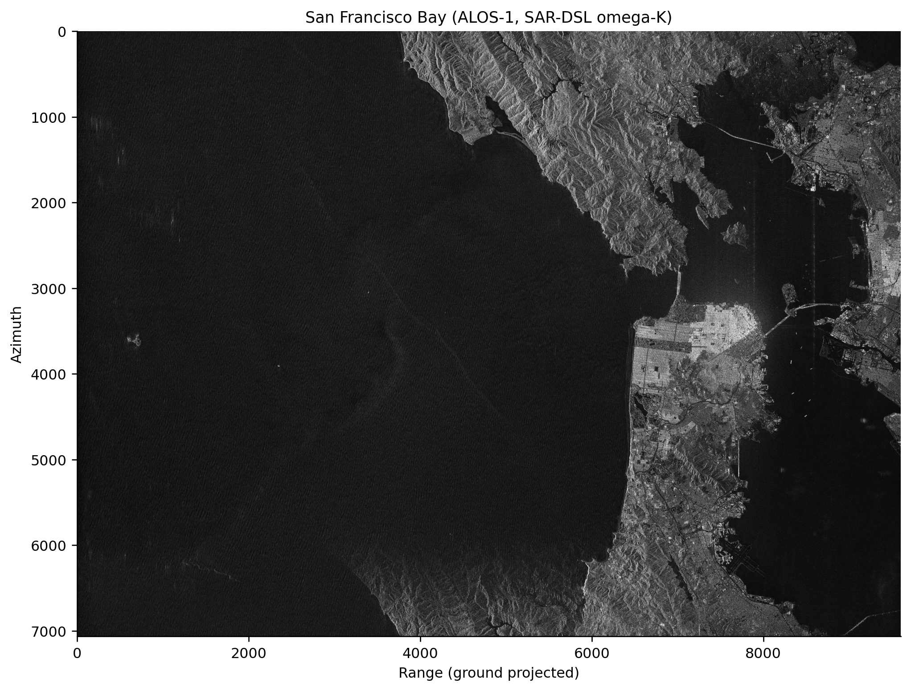
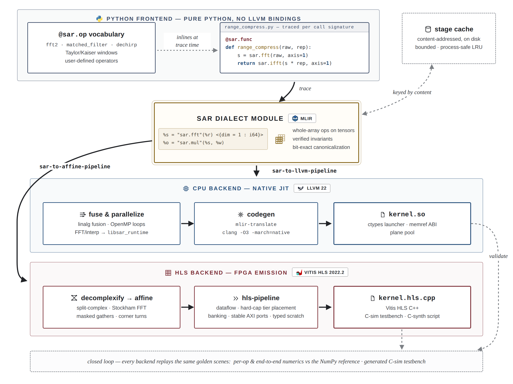
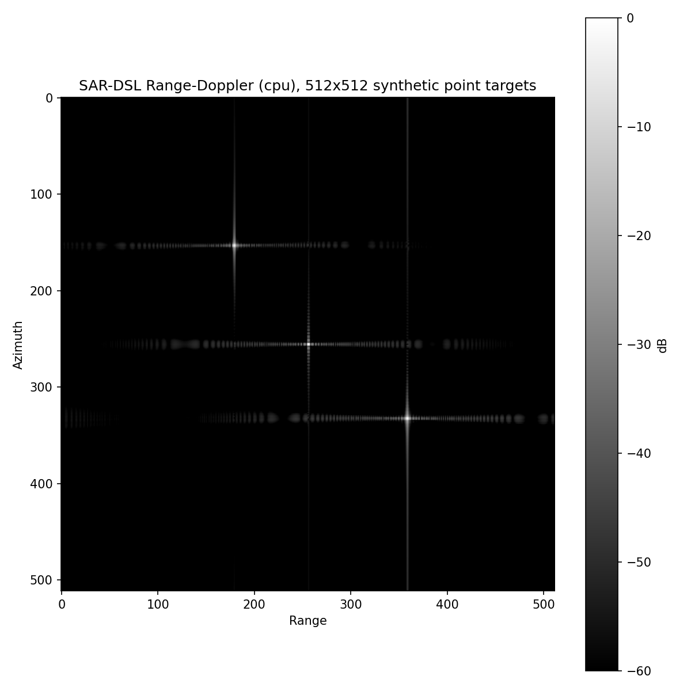
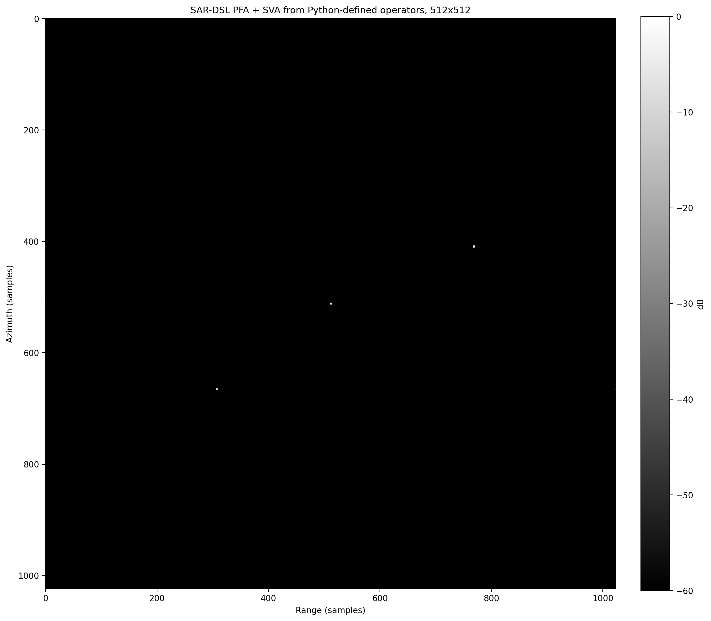

<div align="center">

# SAR-DSL — An MLIR compiler for synthetic aperture radar imaging

[](https://github.com/zeroherolin/sar-dsl/actions/workflows/ci.yml)
[](LICENSE)
[](pyproject.toml)
[](CMakeLists.txt)
[](https://mlir.llvm.org/)
[](docs/backends.md)
[](docs/backends.md)
[](#getting-started)

Express complete SAR imaging pipelines in Python with whole-array operations
such as FFTs, phase transforms, interpolation, and corner turns, then compile
the same statically specialized program to native CPU code or synthesizable
Vitis HLS C++.



*San Francisco Bay: a 16384 × 16384 ALOS-1 scene focused by the SAR-DSL
omega-K kernel.*

</div>

## Highlights

- **One language, two backends.** Every public DSL construct lowers through
  both the native CPU and Vitis HLS paths; backend-specific language operators
  are prohibited by the symmetry tests.
- **Signal-processing structure survives tracing.** FFTs, phase transforms,
  interpolation, reductions, and layout changes remain explicit in MLIR for
  whole-graph scheduling and memory planning.
- **Extensible in Python.** `@sar.op` builds reusable operators from the same
  primitives available to kernels. One definition runs eagerly with NumPy and
  traces into compiled kernels.
- **Complete imaging chains.** Four examples exercise the language and both
  backends end to end:

| Chain | Imaging mode | Main operations |
|-------|--------------|-----------------|
| [Omega-K](examples/wka/) | stripmap | matched filtering, Stolt interpolation |
| [Range-Doppler](examples/rda/) | stripmap | range compression, RCMC |
| [Chirp Scaling](examples/csa/) | stripmap | phase-only range migration correction |
| [Polar Format](examples/pfa/) | spotlight | polar resampling, SVA |

SAR-DSL is a research compiler rather than an FPGA deployment stack. The
repository validates native execution, generated C-simulation, and Vitis HLS
synthesis; Vivado implementation, board drivers, and on-device benchmarking
are outside its scope.

## Quick example

```python
import sar

@sar.func
def range_compress(raw, replica):
    spectrum = sar.fft(raw, axis=1) * replica
    return sar.ifft(spectrum, axis=1)

# The first call specializes the kernel and executes it on the CPU.
image = range_compress(raw_np, replica_np)

# The same kernel can be specialized ahead of time for HLS emission.
design = range_compress.specialize(
    sar.c64[512, 512], sar.c64[512, 512]
).compile("hls", options={"interface": "axi"})
print(design.cpp_path)
```

Kernels specialize by static shape and dtype. NumPy arrays can be captured as
compile-time constants or passed as runtime arguments. See
[Defining operators](docs/defining-ops.md).

## Getting started

The tested host platform is Linux x86-64. Requirements are CMake 3.20+, Ninja,
a C++17 compiler, Python 3.10+, and NumPy. Matplotlib is needed only for
figures; Vitis HLS is optional.

```bash
git clone https://github.com/zeroherolin/sar-dsl.git
cd sar-dsl
git submodule update --init externals/llvm-project
python -m pip install numpy matplotlib pytest

make llvm      # build the pinned LLVM/MLIR toolchain
make build     # build the compiler, runtime, and Python build config
export PYTHONPATH="$PWD/python${PYTHONPATH:+:$PYTHONPATH}"
make test      # pytest and lit
```

Frontend tracing and diagnostics can be tested without building LLVM:

```bash
PYTHONPATH=python python -m pytest test/python -q
```

Generate the four synthetic example images and benchmark figures with:

```bash
make examples
PYTHONPATH=python:examples python benchmarks/run_figures.py
```

## Compiler architecture

<div align="center">

</div>

<!-- Diagram source: docs/assets/how_it_works.html. Regenerate the PNG with
     the command in that file's header after changing the architecture. -->

The Python frontend serializes textual MLIR, avoiding a runtime dependency on
the MLIR Python bindings while leaving authoritative verification to
`sar-opt`. Both backends consume the same core operations.

The CPU pipeline combines linalg fusion, bufferization, OpenMP, LLVM, and a
small FFT/interpolation runtime. The HLS pipeline splits complex values into
real planes, emits mixed-radix affine Stockham FFTs and bounded gathers, plans
on-chip and external storage, and attaches AXI, partition, pipeline, and
storage directives. It emits source, testbench, manifest, and Vitis Tcl files
without requiring Vitis in the user's environment.

Detailed design rationale and IR contracts are in
[Architecture](docs/architecture.md) and [Dialect reference](docs/dialect.md).

## Evaluation

Benchmark runners record raw samples and environment provenance; methodology
and complete reference tables are kept in [benchmarks/](benchmarks/).

### Image formation

The following images are generated by the checked-in CPU examples from the
same 512 × 512 synthetic three-target scene.

<div align="center">
<table>
<tr>
<td align="center" width="50%">
<br/>
<a href="examples/wka/"><b>omega-K (WKA)</b></a><br/>
<em>exact hyperbolic model, Stolt remapping</em>
</td>
<td align="center" width="50%">
<br/>
<a href="examples/rda/"><b>Range-Doppler (RDA)</b></a><br/>
<em>range-dependent RCMC + azimuth filter</em>
</td>
</tr>
<tr>
<td align="center" width="50%">
<br/>
<a href="examples/csa/"><b>Chirp Scaling (CSA)</b></a><br/>
<em>interpolation-free, phase multiplies only</em>
</td>
<td align="center" width="50%">
<br/>
<a href="examples/pfa/"><b>Polar Format (PFA) + SVA</b></a><br/>
<em>built from Python-defined operators</em>
</td>
</tr>
</table>
</div>

<div align="center">


*Range and azimuth impulse-response cuts for the three stripmap chains,
measured with 32× upsampling. The dashed −31.5 dB line is the ideal Hann
first-sidelobe reference, not a bound on the complete imaging chain.*
</div>

Peak location, IRW, PSLR, and ISLR thresholds are regression-tested against
the same NumPy references used for cross-backend accuracy checks.

### CPU whole-graph performance

Warm end-to-end times for the three stripmap examples at 16384 × 16384,
including every FFT, phase operation, interpolation and corner turn:

| Algorithm | SAR-DSL CPU | NumPy reference | Speedup | Throughput |
|---|---:|---:|---:|---:|
| omega-K (WKA) | 3.582 s | 124.08 s | 34.6× | 74.94 Msamples/s |
| Range-Doppler (RDA) | 3.849 s | 157.90 s | 41.0× | 69.74 Msamples/s |
| Chirp Scaling (CSA) | 2.807 s | 73.58 s | 26.2× | 95.64 Msamples/s |

Each row is one timed sample after three warmups, using c128 working
precision. The reference host has 240 logical CPUs; the runtime pool uses 32
workers with LLVM 22, Python 3.12.12, and NumPy 1.26.4. Compilation and
first-touch allocation are excluded. Polar Format is a spotlight chain with a
2× oversampled grid; its CPU sweep through 4096 is in
[benchmarks/](benchmarks/).

### HLS synthesis

The reference HLS target is `xcvu13p-fhgb2104-2-i`, with a 4 ns clock,
512-bit AXI, and 80% device resource budgets.

Generated C++ is checked against NumPy golden outputs in plain-C++, Vitis
C-simulation, and reduced RTL co-simulation. The production c64 rows below use
16384² for the stripmap chains and an 8192² input / 16384² output for PFA.
Latency time is cycles at the target period, which is what the design is
constrained to and what a board would clock it at. The estimated period is
the margin synthesis found, not a second clock rate: a design that closes
below the target still runs at the target.

| Design | Target clock | Estimated clock | Latency cycles | Latency time | C-synth time |
|---|---:|---:|---:|---:|---:|
| WKA, generated | 4.000 ns | 2.920 ns | 9,345,019,968 | 37.380 s | 315 s |
| WKA, hand-written | 4.000 ns | 3.500 ns | 2,033,373,247 | 8.133 s | 201 s |
| RDA, generated | 4.000 ns | 3.187 ns | 6,211,947,741 | 24.848 s | 327 s |
| CSA, generated | 4.000 ns | 3.048 ns | 6,724,960,352 | 26.900 s | 304 s |
| PFA, generated | 4.000 ns | 3.187 ns | 9,807,479,633 | 39.230 s | 181 s |

Resource counts on the reference VU13P device:

| Design | BRAM18K | URAM | DSP | FF | LUT |
|---|---:|---:|---:|---:|---:|
| WKA, generated | 800 | 616 | 1,394 | 420,141 | 587,883 |
| WKA, hand-written | 384 | 296 | 1,135 | 210,325 | 373,962 |
| RDA, generated | 800 | 772 | 471 | 404,717 | 562,545 |
| CSA, generated | 768 | 800 | 317 | 376,572 | 544,839 |
| PFA, generated | 672 | 216 | 394 | 303,030 | 508,243 |

All four generated designs meet the 4 ns target and the configured resource
budgets. WKA's latency is 4.60× the worst-case cycles of the independent
hand-written baseline. The baseline uses packed AXI and a different
microarchitecture, so the comparison is directional rather than like-for-like.
Vitis reports a latency range for the hand-written design because it reuses
transform and corner-turn instances across runtime modes; the table records
the worst case. All timing values are HLS estimates, not post-place-and-route
closure. Constraints, source/report hashes, and
derived strategies are in the
[machine-readable summary](benchmarks/results/hls_algorithms_c64_production_vitis_2022_2.json).

## Documentation

| Document | Contents |
|----------|----------|
| [Python API](docs/python-api.md) | Public language and compiler API |
| [MATLAB guide](docs/matlab-users.md) | Indexing, naming, and convention mapping |
| [Architecture](docs/architecture.md) | Compiler layers and design rationale |
| [Dialect reference](docs/dialect.md) | Operations, invariants, and passes |
| [Defining operators](docs/defining-ops.md) | `@sar.op` and specialization |
| [Backends](docs/backends.md) | CPU, HLS, configuration, and extension API |
| [Benchmarks](benchmarks/README.md) | Methodology and reference measurements |
| [Roadmap](docs/roadmap.md) | Verified scope and remaining work |
| [Contributing](CONTRIBUTING.md) | Build, style, and test conventions |

## Repository layout

```text
include/sar/, lib/   dialects, analyses, conversions, and pipelines
runtime/             CPU runtime with a stable C ABI
tools/               sar-opt, sar-translate, and sar-lsp-server
python/sar/          Python language, compiler driver, and backends
examples/            complete WKA, RDA, CSA, and PFA programs
benchmarks/          accuracy, quality, performance, and HLS report tools
test/                MLIR lit tests and Python tests
docs/                architecture, backend, dialect, and API references
cmake/, scripts/     build configuration and the LLVM bootstrap script
externals/           pinned llvm-project submodule
```

## Citation

No archival publication is associated with this repository. GitHub exposes the
software citation in [CITATION.cff](CITATION.cff); include the commit hash used
for an experiment so generated code and measurements remain reproducible.

## License

MIT — see [LICENSE](LICENSE). The compiler builds on
[LLVM/MLIR](https://mlir.llvm.org/). External SAR datasets are not
redistributed by this repository.
