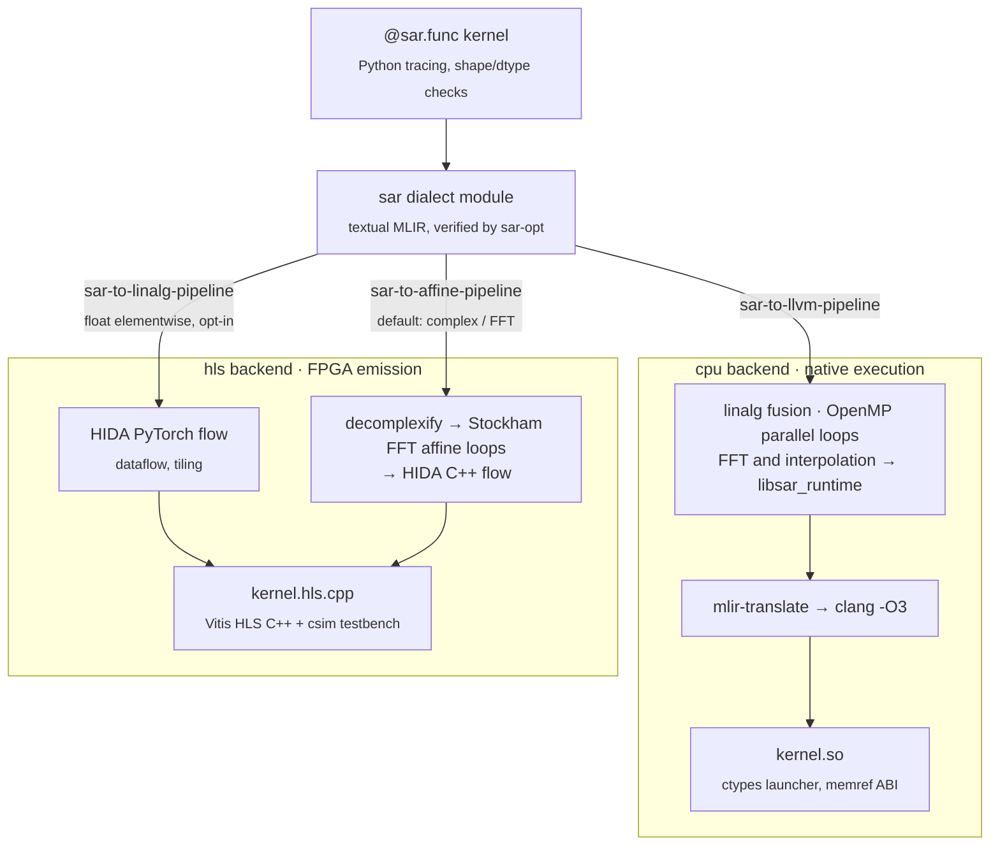
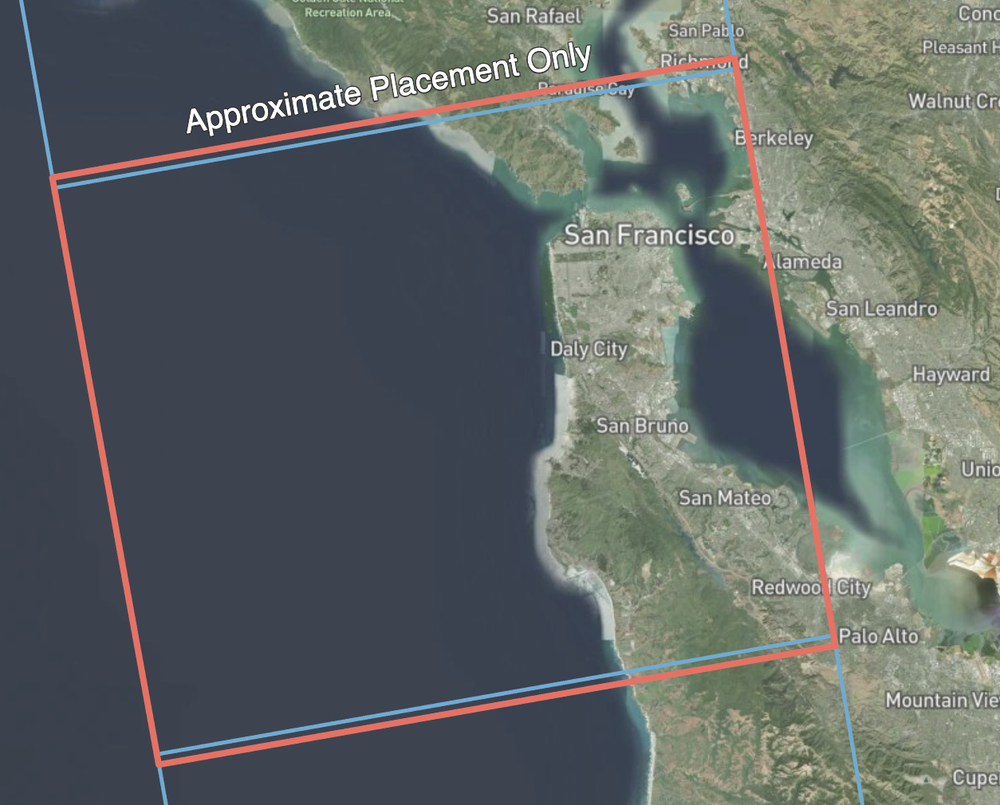
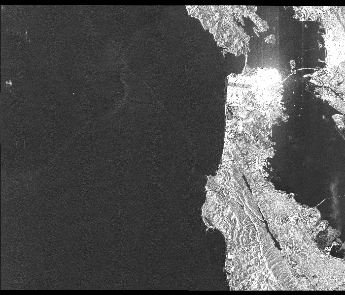

<div align="center">

# SAR-DSL — An MLIR compiler for synthetic aperture radar imaging

[](https://github.com/zeroherolin/sar-dsl/actions/workflows/ci.yml)
[](LICENSE)
[](pyproject.toml)
[](CMakeLists.txt)
[](https://mlir.llvm.org/)
[](docs/backends.md)
[](docs/backends.md)
[](README.md#status-and-roadmap)

Write SAR imaging pipelines in Python at the granularity of whole stages —
FFTs, phase multiplies, Stolt interpolation, corner turns — and compile
them to native CPU code or synthesizable FPGA designs.


*San Francisco Bay: 16384 x 16384 raw ALOS-1 echoes focused by a single
compiled omega-K kernel in 3.6 seconds.*

</div>

---

## Highlights

- **Four complete imaging algorithms.** omega-K (WKA), Range-Doppler
  (RDA) and Chirp Scaling (CSA) as built-in-op chains demonstrated on
  real satellite data, plus spotlight Polar Format (PFA) assembled
  entirely from Python-defined operators. Each is a single compiled
  kernel, validated against a NumPy reference and cross-checked on
  point targets ([examples/](examples/)).
- **Multi-backend by construction.** A `cpu` backend executes kernels
  natively (linalg fusion, OpenMP, `libsar_runtime` FFT); a `hls`
  backend emits Vitis HLS C++ through
  [HLS-HIDA](https://github.com/UIUC-ChenLab/HLS-HIDA). Every SAR
  operation has an HLS lowering — FFTs as bit-reversal-free Stockham affine
  loops, interpolation as straight-line masked gathers — so **complete
  imaging chains emit as single FPGA designs**, each with a generated
  C-simulation testbench that all four algorithms pass bit-exactly.
  New targets plug in as [backend packages](docs/backends.md) without
  core changes.
- **A real dialect, not a wrapper.** A small orthogonal IR (spectral,
  element-wise, reductions, selection, layout) with
  MLIR-verified domain invariants, bit-exact canonicalization folds and
  trace-time spectral-domain diagnostics — plus a Matlab/scipy-familiar
  vocabulary (`fft2`, `matched_filter`, `dechirp`, `mag2db`, `sinc`,
  Taylor/Kaiser windows, ...) that decomposes into those primitives at
  trace time. Indexing is 0-based throughout — see
  [docs/matlab-users.md](docs/matlab-users.md) for the full mapping.
- **Operators are defined in Python.** `@sar.op` declares an operator
  that inlines into kernels on every backend and runs eagerly on numpy
  arrays; the built-in vocabulary uses the same mechanism
  ([docs/defining-ops.md](docs/defining-ops.md)). Kernels (`@sar.func`)
  need no type annotations (they specialize per call) and numpy arrays
  mix freely with tensors.
- **Tested like a compiler.** FileCheck suites for every pass, per-op
  numerics against NumPy, end-to-end algorithm equivalence, memory-leak
  regression, and a differential fuzzer comparing random DSL programs
  against a NumPy oracle.

## Quick example

```python
import sar

@sar.func
def range_compress(raw, replica):     # specializes per call, numpy-style
    spectrum = sar.fft(raw, axis=1) * replica
    return sar.ifft(spectrum, axis=1)

image = range_compress(raw_np, replica_np)            # JIT on CPU

hls = range_compress.specialize(sar.c64[512, 512], sar.c64[512, 512])
print(hls.compile(backend="hls").cpp_path)       # or emit HLS C++
```

## How it works

Calling a kernel traces the Python function into a small MLIR dialect of
whole-array SAR operations; the selected backend then runs a pipeline of
compilation *stages* over it (cached on disk, keyed by content):



The design decisions behind this shape — and their trade-offs — are laid
out in [docs/architecture.md](docs/architecture.md). The short version:

| Decision | Why |
|----------|-----|
| Ops on builtin tensors (like TOSA/StableHLO) | no custom type conversions; all upstream MLIR machinery just works |
| Textual IR as the frontend boundary | pure-Python frontend, zero LLVM API coupling; `sar-opt` verifiers remain authoritative |
| Runtime library for CPU FFT/interpolation | the vendor-library pattern (cf. cuFFT): pipeline structure is the compiler's job, leaf transforms are not |
| Split-complex + Stockham FFT for HLS | no bit-reversal means fully affine accesses — synthesizable, and validated against NumPy on the CPU |
| Interpolation as straight-line masked gathers | clamped indices + select-masked taps instead of control flow, keeping HLS loop pipelining applicable |

## Gallery: four algorithms, one compiler

Each image below is the output of a single compiled kernel on the same
512 x 512 synthetic point-target scene (details and real-data runs in
[examples/](examples/)):

<div align="center">
<table>
<tr>
<td align="center" width="50%">
<br/>
<a href="examples/wka/"><b>omega-K (WKA)</b></a><br/>
<em>exact hyperbolic model, Stolt remapping</em>
</td>
<td align="center" width="50%">
<br/>
<a href="examples/rda/"><b>Range-Doppler (RDA)</b></a><br/>
<em>range-dependent RCMC + azimuth filter</em>
</td>
</tr>
<tr>
<td align="center" width="50%">
<br/>
<a href="examples/csa/"><b>Chirp Scaling (CSA)</b></a><br/>
<em>interpolation-free, phase multiplies only</em>
</td>
<td align="center" width="50%">
<br/>
<a href="examples/pfa/"><b>Polar Format (PFA) + SVA</b></a><br/>
<em>built from Python-defined operators</em>
</td>
</tr>
</table>
</div>

## Focusing quality

<div align="center">


*Point-target impulse response of the three compiled imaging chains
(band-matched Hann tapers, 32x upsampled cuts). All three sit on the
same mainlobe with first sidelobes below the Hann bound; peak position
error is zero.*
</div>

Measured IRW / PSLR / ISLR values are tabulated in
[benchmarks/README.md](benchmarks/README.md) and gated in CI by
`test/python/test_quality.py`.

On real data, the compiled omega-K chain reproduces the scene content
of the official JAXA product from raw Level-1.0 echoes:

<div align="center">
<table>
<tr>
<td align="center" width="33%">
<br/>
<em>scene footprint</em>
</td>
<td align="center" width="33%">
<br/>
<em>official JAXA L1.1 product</em>
</td>
<td align="center" width="33%">
<br/>
<em>SAR-DSL, from raw L1.0</em>
</td>
</tr>
</table>
</div>

<div align="center">


*Spatially variant apodization in the PFA example — data-dependent
per-pixel selection written as ordinary Python with `sar.where`. SVA
removes the -13.3 dB uniform-weighting sidelobes while preserving the
mainlobe.*
</div>

The point-target and SVA figures regenerate with
`python benchmarks/run_figures.py`.

## Performance

Full omega-K imaging chain, 240-core x86-64 server
([benchmarks/](benchmarks/)):

| Scene | SAR-DSL (cpu) | NumPy reference | Speedup |
|-------|--------------:|----------------:|--------:|
| 1024 x 1024 synthetic | 0.22 s | 0.49 s | 2.2x |
| 4096 x 4096 synthetic | 0.80 s | 6.36 s | 8.0x |
| 16384 x 16384 ALOS-1 | 3.6 s | ~15 min* | ~250x |

<sup>* extrapolated; the reference Stolt loop is impractical at this
size.</sup>

## Getting started

Requirements: cmake >= 3.20, ninja, a C++17 host compiler, Python >= 3.10
with numpy (matplotlib for the examples).

```bash
git clone https://github.com/zeroherolin/sar-dsl.git && cd sar-dsl
git submodule update --init externals/llvm-project externals/HLS-HIDA
pip install numpy matplotlib pytest   # matplotlib/pytest: examples & tests

make llvm        # 1. in-tree LLVM/MLIR/Clang toolchain (one-time, long)
make build       # 2. sar-opt, libsar_runtime, tests
make hls    # 3. optional: HLS-HIDA toolchain for the HLS backend

export PYTHONPATH=$PWD/python:$PYTHONPATH
make test        # lit + pytest, everything should pass
make examples    # focus a 512x512 synthetic scene, writes a PNG
```

The example runners insert `python/` into `sys.path` themselves, so they
also work without the `PYTHONPATH` export.

Step 3 builds our [HLS-HIDA fork](https://github.com/zeroherolin/HLS-HIDA)
(`dev` branch: ported to this project's LLVM, bug fixes land as regular
commits) against the same LLVM tree as step 1 — one toolchain for
everything.

To reproduce the San Francisco image, place the ALOS-1 CEOS product under
`examples/data/` and run:

```bash
python examples/data/extract_alos.py   # CEOS L1.0 -> alos_raw_16384x16384.bin
python examples/wka/run_alos_cpu.py
```

## Documentation

| Document | Contents |
|----------|----------|
| [docs/matlab-users.md](docs/matlab-users.md) | Coming from Matlab: indexing, name mapping, conventions |
| [docs/architecture.md](docs/architecture.md) | Layering, design decisions and their rationale |
| [docs/dialect.md](docs/dialect.md) | The `sar` dialect reference: ops, passes, pipelines |
| [docs/defining-ops.md](docs/defining-ops.md) | Defining operators with `@sar.op` |
| [docs/backends.md](docs/backends.md) | Backend guide: cpu, hls, adding your own |
| [docs/roadmap.md](docs/roadmap.md) | What is done, what is next, what is out of scope |
| [examples/wka/README.md](examples/wka/README.md) | omega-K walkthrough (synthetic + real data) |
| [examples/rda/README.md](examples/rda/README.md) | Range-Doppler walkthrough |
| [examples/csa/README.md](examples/csa/README.md) | Chirp Scaling walkthrough (interpolation-free) |
| [examples/pfa/README.md](examples/pfa/README.md) | Polar Format + SVA from Python-defined operators |
| [CONTRIBUTING.md](CONTRIBUTING.md) | Development setup and conventions |

## Project layout

```
include/sar/, lib/       C++ core: dialect, conversions, pipelines
runtime/                 libsar_runtime (FFT, interpolation kernels; C ABI)
tools/                   sar-opt (optimizer driver), sar-lsp-server (editor)
python/sar/              sar package: language, ir, compiler, backends
third_party/             backend plugins (cpu, hls)
examples/                omega-K, Range-Doppler, Chirp Scaling, PFA
benchmarks/              timing, image-quality metrics and figures
test/                    lit suites (MLIR) and pytest suites (Python, e2e, fuzz)
externals/               submodules: llvm-project, HLS-HIDA
scripts/                 toolchain build scripts
```

## Status and roadmap

SAR-DSL is a research compiler. Current limits, by design or pending work
(see [docs/roadmap.md](docs/roadmap.md)):

- All shapes are static: one compile per geometry.
- Every DSL construct compiles to every backend, with no capability
  asymmetry between them.
- HLS designs C-simulate bit-exactly against their generated testbenches,
  but on-device place-and-route/timing closure is left to Vitis. Scene
  size is bounded by DRAM rather than by the device: the full
  16384 x 16384 ALOS raster emits as a single design, with the backend
  deciding what stays on chip ([docs/backends.md](docs/backends.md)).
- The `cpu` backend targets the *host* machine (JIT); it is tested on
  x86-64 Linux. Other Linux architectures with an LLVM host target should
  work but are unverified; Windows is unsupported.
- Prebuilt wheels are not published; the toolchain builds from source.

Contributions are welcome — see [CONTRIBUTING.md](CONTRIBUTING.md).

## License

MIT — see [LICENSE](LICENSE). Built on
[LLVM/MLIR](https://mlir.llvm.org/) and
[HLS-HIDA](https://github.com/UIUC-ChenLab/HLS-HIDA); sample
imagery derives from JAXA ALOS-1 PALSAR data.
