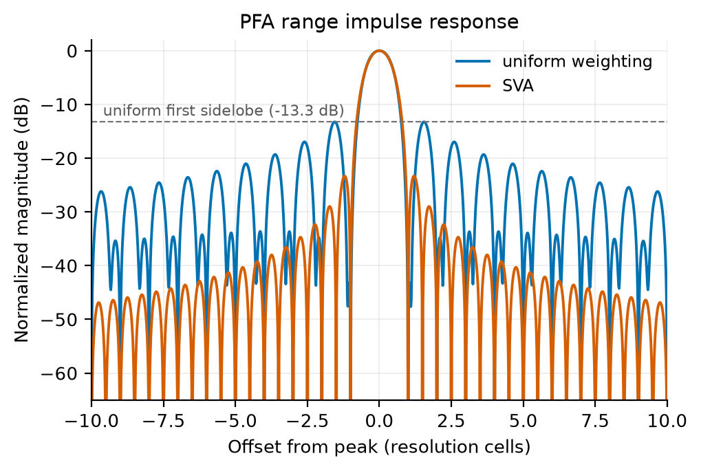

<div align="center">

# SAR-DSL — An MLIR compiler for synthetic aperture radar imaging

[](https://github.com/zeroherolin/sar-dsl/actions/workflows/ci.yml) [](LICENSE) [](pyproject.toml) [](CMakeLists.txt) [](https://mlir.llvm.org/) [](docs/backends.md) [](docs/backends.md) [](#getting-started)

Express complete SAR imaging pipelines in Python with whole-array operations such as FFTs, phase transforms, interpolation, and corner turns, then compile the same statically specialized program to native CPU code or synthesizable Vitis HLS C++.


_San Francisco Bay: a 16384 × 16384 ALOS-1 scene focused by the SAR-DSL omega-K kernel._

</div>

## Highlights

- **One language, two backends.** Every public DSL construct lowers through both the native CPU and Vitis HLS paths; backend-specific language operators are prohibited by the symmetry tests.
- **Signal-processing structure survives tracing.** FFTs, phase transforms, interpolation, reductions, and layout changes remain explicit in MLIR for whole-graph scheduling and memory planning.
- **Extensible in Python.** `@sar.op` builds reusable operators from the same primitives available to kernels. One definition runs eagerly with NumPy and traces into compiled kernels.
- **Complete imaging chains.** Four examples exercise the language and both backends end to end:

| Algorithm | Imaging mode | Main operations |
| --- | --- | --- |
| [Omega-K](examples/wka/) | stripmap | matched filtering, Stolt interpolation |
| [Range-Doppler](examples/rda/) | stripmap | range compression, RCMC |
| [Chirp Scaling](examples/csa/) | stripmap | phase-only range migration correction |
| [Polar Format](examples/pfa/) | spotlight | polar resampling, SVA |

SAR-DSL is a research compiler rather than an FPGA deployment stack. The repository validates native execution, generated C-simulation, and Vitis HLS synthesis; Vivado implementation, board drivers, and on-device benchmarking are outside its scope.

## Quick example

```python
import sar

@sar.func
def range_compress(raw, replica):
    spectrum = sar.fft(raw, axis=1) * replica
    return sar.ifft(spectrum, axis=1)

# The first call specializes the kernel and executes it on the CPU.
image = range_compress(raw_np, replica_np)

# The same kernel can be specialized ahead of time for HLS emission.
design = range_compress.specialize(
    sar.c64[512, 512], sar.c64[512, 512]
).compile("hls", options={"interface": "axi"})
print(design.cpp_path)
```

Kernels specialize by static shape and dtype. NumPy arrays can be captured as compile-time constants or passed as runtime arguments. See [Defining operators](docs/defining-ops.md).

## Compiler architecture

<div align="center">

</div>

The Python frontend serializes textual MLIR, avoiding a runtime dependency on the MLIR Python bindings while leaving authoritative verification to `sar-opt`. Both backends consume the same core operations.

The CPU pipeline combines linalg fusion, bufferization, OpenMP, LLVM, and a small FFT/interpolation runtime. The HLS pipeline splits complex values into real planes, emits mixed-radix affine Stockham FFTs and bounded gathers, plans on-chip and external storage, and attaches AXI, partition, pipeline, and storage directives. It emits a declaration header, top-first implementation, testbench, manifest, and Vitis Tcl files without requiring Vitis in the user's environment.

Detailed design rationale and IR contracts are in [Architecture](docs/architecture.md) and [Dialect reference](docs/dialect.md).

## Evaluation

Three questions, in order: does the compiler focus imagery correctly, what does the CPU backend cost against a NumPy implementation of the same algorithm, and does the generated HLS fit a real device. Benchmark runners record raw samples and environment provenance; methodology and complete reference tables are kept in [benchmarks/](benchmarks/).

### Image formation

Each chain focuses the same 512 × 512 synthetic three-target scene, run by the checked-in CPU examples.

<div align="center">
<table>
<tr>
<td align="center" valign="top" width="50%">
<br/>
<a href="examples/wka/"><b>omega-K (WKA)</b></a><br/>
<em>exact hyperbolic model, Stolt remapping</em>
</td>
<td align="center" valign="top" width="50%">
<br/>
<a href="examples/rda/"><b>Range-Doppler (RDA)</b></a><br/>
<em>range-dependent RCMC + azimuth filter</em>
</td>
</tr>
<tr>
<td align="center" valign="top" width="50%">
<br/>
<a href="examples/csa/"><b>Chirp Scaling (CSA)</b></a><br/>
<em>interpolation-free, phase multiplies only</em>
</td>
<td align="center" valign="top" width="50%">
<br/>
<a href="examples/pfa/"><b>Polar Format (PFA) + SVA</b></a><br/>
<em>built from Python-defined operators</em>
</td>
</tr>
</table>
</div>

<div align="center">


_Range and azimuth impulse-response cuts for the three stripmap chains, measured with 32× upsampling. The dashed −31.5 dB line is the ideal Hann first-sidelobe reference, not a bound on the complete imaging chain._

</div>

Peak location, IRW, PSLR, and ISLR thresholds are regression-tested against the same NumPy references used for cross-backend accuracy checks.

Polar format is assembled entirely from Python-defined operators, spatially variant apodization among them — it suppresses the uniform-weighting sidelobes without broadening the mainlobe, which no amplitude window can do:

<div align="center">


_PFA range cut before and after SVA. The dashed line is the −13.3 dB first sidelobe of uniform weighting._

</div>

### Real data

The three stripmap chains focus the ALOS-1 San Francisco Bay acquisition — 16384 × 16384 raw echoes, the same collection the hand-written HLS reference implements.

<div align="center">
<table>
<tr>
<td align="center" valign="top" width="33%"></td>
<td align="center" valign="top" width="33%"></td>
<td align="center" valign="top" width="33%"></td>
</tr>
<tr>
<td align="center"><b>omega-K</b></td>
<td align="center"><b>Chirp Scaling</b></td>
<td align="center"><b>Range-Doppler</b></td>
</tr>
</table>
</div>

Original data © JAXA/METI; the product itself is not redistributed here. See [examples/](examples/) for the extraction step and the per-chain runners.

### CPU backend performance

Warm end-to-end times for the four examples, including every FFT, phase operation, interpolation and corner turn. The performance results below use `c128` precision.

| Algorithm | Input → output | SAR-DSL CPU | NumPy reference | Speedup | Throughput |
| --- | --: | --: | --: | --: | --: |
| omega-K (WKA) | 16384² → 16384² | 3.684 s | 186.53 s | 50.6× | 72.87 Msamples/s |
| Range-Doppler (RDA) | 16384² → 16384² | 3.911 s | 105.00 s | 26.8× | 68.63 Msamples/s |
| Chirp Scaling (CSA) | 16384² → 16384² | 2.525 s | 73.43 s | 29.1× | 106.31 Msamples/s |
| Polar Format (PFA) | 8192² → 16384² | 3.761 s | 155.43 s | 41.3× | 17.84 Msamples/s |

<div align="center">
<table>
<tr>
<td align="center" valign="top" width="50%">
<br/>
<em>Speedup over NumPy. Fusion removes intermediate planes, so gains generally grow with scene size.</em>
</td>
<td align="center" valign="top" width="50%">
<br/>
<em>Absolute kernel throughput. Compile time is excluded; each point is the best of three warm runs.</em>
</td>
</tr>
</table>
</div>

Each row is the best of three timed runs after three warm-ups. The reference host has 120 physical cores with two hardware threads each (240 logical CPUs). The toolchain was LLVM 22, Python 3.12.13, and NumPy 2.5.2. Compilation and first-touch allocation are excluded. Full CPU methodology and results are in [benchmarks/](benchmarks/).

### HLS backend synthesis

The reference HLS target is `xcvu13p-fhgb2104-2-i`, with a 4 ns board clock, an explicit 12.5% HLS uncertainty (3.5 ns scheduling budget), paired 256-bit split-complex AXI planes, and 80% device resource budgets.

The stripmap synthesis results below use `c64` precision at the ALOS-1 acquisition geometry -- the collection the hand-written reference implements, so the WKA comparison measures the same problem. PFA uses its spotlight collection geometry and is reported at the same production scale separately.

| Design | Input → output | Target clock | Estimated clock | Latency cycles | Latency time | C-synth time |
| --- | --: | --: | --: | --: | --: | --: |
| omega-K, generated | 16384² → 16384² | 4.000 ns | 3.500 ns | 1,826,362,444 | 7.305 s | 702 s |
| omega-K, hand-written | 16384² → 16384² | 4.000 ns | 3.500 ns | 1,350,448,211 | 5.402 s | 419 s |
| Range-Doppler, generated | 16384² → 16384² | 4.000 ns | 3.500 ns | 1,447,542,968 | 5.790 s | 578 s |
| Chirp Scaling, generated | 16384² → 16384² | 4.000 ns | 3.627 ns | 1,116,717,166 | 4.467 s | 451 s |
| PFA, generated | 8192² → 16384² | 4.000 ns | 3.500 ns | 5,848,664,417 | 23.395 s | 289 s |

Resource counts on the reference VU13P device:

| Design | Input → output | BRAM18K | URAM | DSP | FF | LUT |
| --- | --: | --: | --: | --: | --: | --: |
| omega-K, generated | 16384² → 16384² | 1,410 | 960 | 2,668 | 767,232 | 860,085 |
| omega-K, hand-written | 16384² → 16384² | 672 | 848 | 2,860 | 769,377 | 658,256 |
| Range-Doppler, generated | 16384² → 16384² | 1,736 | 852 | 1,453 | 686,807 | 697,239 |
| Chirp Scaling, generated | 16384² → 16384² | 1,736 | 840 | 2,024 | 593,904 | 638,714 |
| PFA, generated | 8192² → 16384² | 65 | 512 | 854 | 292,404 | 420,121 |

<div align="center">


_The same counts as a share of the budget each resource is constrained by. The gray bars are the independent hand-written omega-K implementation, not a fifth algorithm. UltraRAM is the binding tier for the stripmap chains; no design reaches a cap._

</div>

All timing values are HLS estimates, not post-place-and-route closure. Constraints, source/report hashes, and derived strategies are in the [machine-readable summary](benchmarks/results/hls_algorithms_c64_production_vitis_2022_2.json).

Where a plane lives is the compiler's decision, not a directive the user writes. Scaling the configured BRAM, URAM and LUTRAM caps retunes local storage while the top-level interface remains stable:

<div align="center">


_Compiler-selected interfaces and logical storage as the configured device memory caps scale from 10% to 100%. The local-storage panel is emitted-array payload, not synthesized BRAM/URAM primitive utilization._

</div>

Methodology and per-design analysis are in the [benchmark report](benchmarks/README.md#vitis-hls-synthesis-baselines); constraints, source/header/report hashes, and derived strategies are in the [machine-readable summary](benchmarks/results/hls_algorithms_c64_production_vitis_2022_2.json).

## Getting started

The tested host platform is Linux x86-64. Requirements are CMake 3.20+, Ninja, a C++17 compiler, Python 3.10+, and NumPy. Matplotlib is needed only for figures; Vitis HLS is optional.

```bash
git clone https://github.com/zeroherolin/sar-dsl.git
cd sar-dsl
git submodule update --init externals/llvm-project
python -m pip install numpy matplotlib pytest

make llvm      # build the pinned LLVM/MLIR toolchain
make build     # build the compiler, runtime, and Python build config
export PYTHONPATH="$PWD/python${PYTHONPATH:+:$PYTHONPATH}"
make test      # pytest and lit
```

GitHub Actions uses the matching prebuilt LLVM 22.1.8 release and builds only SAR-DSL; the source build above remains the reproducible local development path.

Frontend tracing and diagnostics can be tested without building LLVM:

```bash
PYTHONPATH=python python -m pytest test/python -q
```

Reproducing the figures above: the imaging and impulse-response figures re-run the chains, while the summary figures redraw the checked-in measurements and need neither Vitis nor the reference host.

```bash
make examples                                   # the four chain images
PYTHONPATH=python:examples python benchmarks/plot_cpu_impulse_response.py
python benchmarks/plot_cpu_hls_results.py
```

## Documentation

| Document | Contents |
| --- | --- |
| [Python API](docs/python-api.md) | Public language and compiler API |
| [MATLAB guide](docs/matlab-users.md) | Indexing, naming, and convention mapping |
| [Architecture](docs/architecture.md) | Compiler layers and design rationale |
| [Dialect reference](docs/dialect.md) | Operations, invariants, and passes |
| [Defining operators](docs/defining-ops.md) | `@sar.op` and specialization |
| [Backends](docs/backends.md) | CPU, HLS, configuration, and extension API |
| [Benchmarks](benchmarks/README.md) | Methodology and reference measurements |
| [Project scope](docs/scope.md) | Supported scope, known limits, and non-goals |
| [Contributing](CONTRIBUTING.md) | Build, style, and test conventions |

## Repository layout

```text
include/sar/, lib/   dialects, analyses, conversions, and pipelines
runtime/             CPU runtime with a stable C ABI
tools/               sar-opt, sar-translate, and sar-lsp-server
python/sar/          Python language, compiler driver, and backends
examples/            complete WKA, RDA, CSA, and PFA programs
benchmarks/          accuracy, quality, performance, and HLS report tools
test/                MLIR lit tests and Python tests
docs/                architecture, backend, dialect, and API references
cmake/, scripts/     build configuration and the LLVM bootstrap script
externals/           pinned llvm-project submodule
```

## Citation

No archival publication is associated with this repository yet. GitHub exposes the software citation in [CITATION.cff](CITATION.cff); include the commit hash used for an experiment so generated code and measurements remain reproducible.

## License

MIT — see [LICENSE](LICENSE). The compiler builds on [LLVM/MLIR](https://mlir.llvm.org/). External SAR datasets are not redistributed by this repository.
