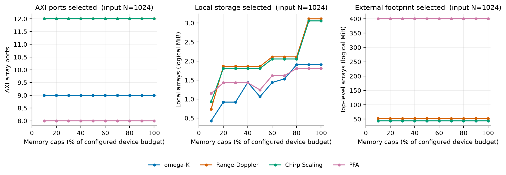
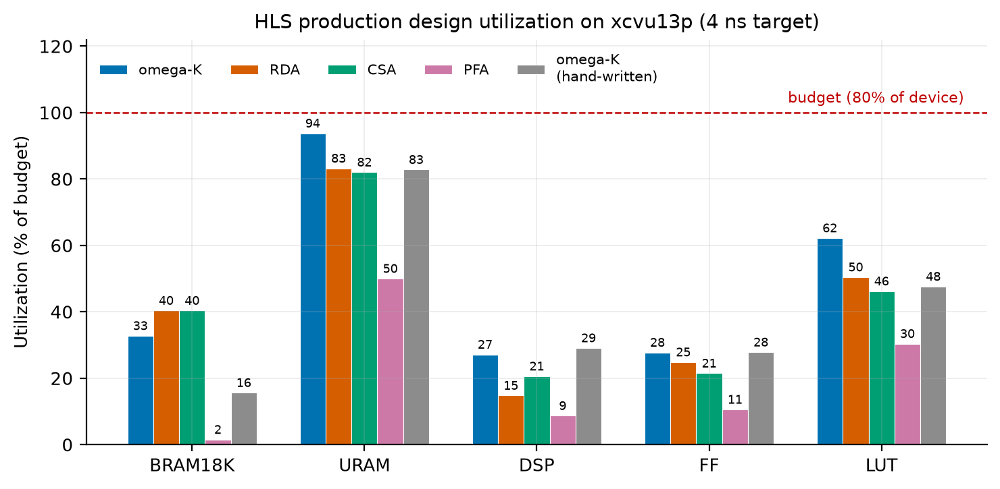
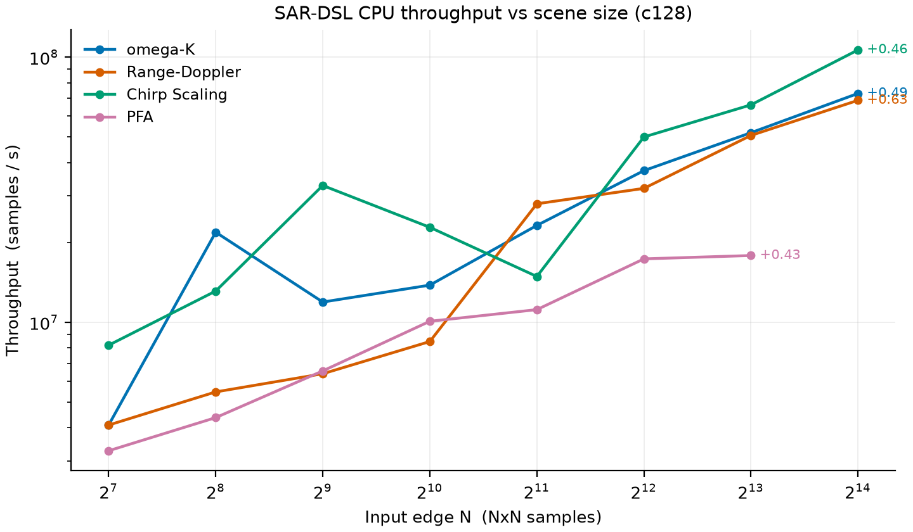
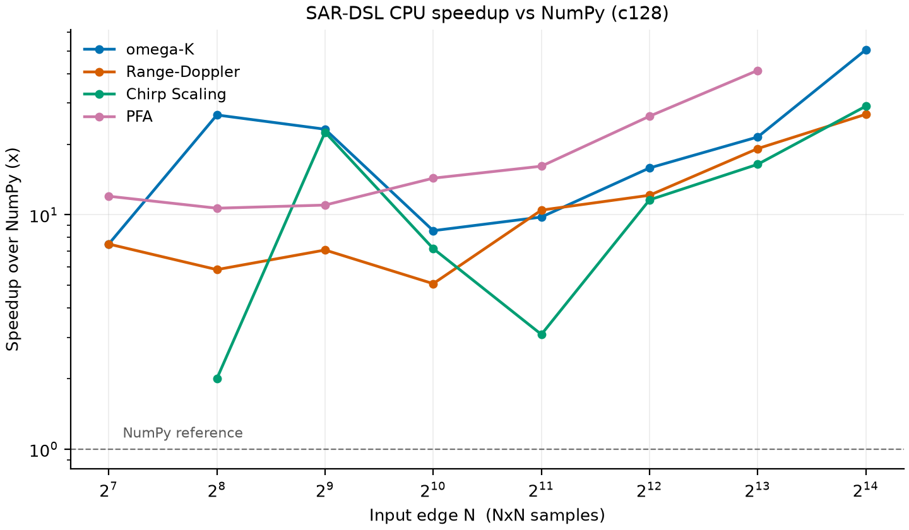
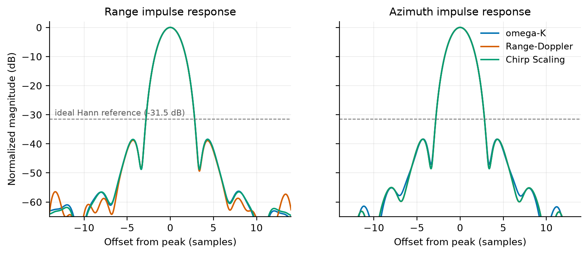

# Benchmarks

| File | Purpose |
| --- | --- |
| `algorithms.py` | Registry of the benchmarked imaging chains (setup, run, reference) |
| `metrics.py` | Point-target metrics: IRW / PSLR / ISLR (also used by `test/python/test_quality.py`) |
| `run_cpu_performance.py` | CPU timing and throughput-N curves against the NumPy references; reports cold and warm separately |
| `run_cpu_hls_accuracy.py` | CPU and generated-design accuracy against the same NumPy reference; `hls_csim` is used when Vitis HLS is installed, otherwise `portable_cpp_sim` |
| `run_cpu_quality.py` | CPU image-quality table |
| `run_cpu_precision.py` | CPU single-precision image-quality comparison for all four chains |
| `run_hls_resources.py` | HLS device-cost report; `--budget-sweep` covers port/memory vs budget |
| `run_hls_sweep.py` | Bounded, content-addressed Vitis csynth DSE with timeout/RSS/disk guards |
| `plot_cpu_impulse_response.py` | Draws `cpu_point_target_response.png` and `cpu_pfa_sva_response.png` (focuses a scene, so it needs the CPU backend) |
| `plot_cpu_hls_results.py` | Draws the recorded `cpu_throughput.png`, `cpu_speedup.png`, `hls_resource_utilization.png`, and `hls_budget_sweep.png`; it measures nothing and needs no toolchain |
| `hls_reports.py` | Parses csynth XML bundles and checks them against the constraints |
| `provenance.py` | Records the host, toolchain and library versions a run was measured on |

```bash
PYTHONPATH=python python3 benchmarks/run_cpu_performance.py \
    --sizes 128 256 512 1024 2048 4096 8192 16384 --numpy
PYTHONPATH=python python3 benchmarks/run_cpu_hls_accuracy.py --n 128
PYTHONPATH=python python3 benchmarks/run_cpu_quality.py --n 512
PYTHONPATH=python python3 benchmarks/run_cpu_precision.py --n 512
PYTHONPATH=python python3 benchmarks/run_hls_resources.py --sizes 512 4096
PYTHONPATH=python python3 benchmarks/run_hls_resources.py \
    --budget-sweep --sweep-size 1024 --sweep-steps 10
PYTHONPATH=python python3 benchmarks/run_hls_sweep.py \
    --algs wka --size 16384 --dtype c64 --workers 2
PYTHONPATH=python python3 benchmarks/run_cpu_hls_accuracy.py \
    --n 512 --algs wka rda csa pfa --dtype c128 --keep-dir /tmp/c128-512-sim
PYTHONPATH=python python3 benchmarks/run_hls_sweep.py \
    --algs wka rda csa pfa --size 512 --dtype c128 --geometry synthetic \
    --baseline-only --workers 4
PYTHONPATH=python python3 benchmarks/plot_cpu_impulse_response.py
python3 benchmarks/plot_cpu_hls_results.py
```

## Precision

Narrowing the data path narrows the kernel _boundary_; inside the body a phase-multiply that combines a c64 data plane with an f64 geometry plane widens back to c128 (SAR-DSL promotes on mixed-precision ops, like NumPy). The "c64/c128 refs" column counts textual 2-D complex-type references in the traced IR. It describes composition, not distinct allocations.

PFA's collection axes bake into the IR as f64 constants (they feed `interp1d` positions, which the language requires to be f64), so its only narrowable input is the phase-history plane itself. Geometry stays double in all chains.

Single precision is a first-class build option: every chain's `build_kernel` takes `dtype=sar.c64` (default `sar.c128`), which threads the precision through the annotations, the widening cast and the result types. The mode label reports what the build narrowed: the stripmap chains take their window/axis vectors down with the data (`c64+f32`), PFA narrows the data plane alone (`c64 only`).

Results at input edge N=512 on a 240-logical-CPU x86-64 host:

| Algorithm | Precision | IRW | PSLR | ISLR | Rel. error | c64/c128 refs |
| --- | --- | --: | --: | --: | --: | --: |
| omega-K | f64 | 2.06 | -38.44 dB | -29.01 dB | — | — |
| omega-K | f32 (c64+f32) | 2.06 | -38.44 dB | -29.01 dB | 7.7e-07 | 52 / 2 |
| Range-Doppler | f64 | 2.06 | -38.79 dB | -26.54 dB | — | — |
| Range-Doppler | f32 (c64+f32) | 2.06 | -38.79 dB | -26.54 dB | 1.9e-07 | 28 / 0 |
| Chirp Scaling | f64 | 2.06 | -38.48 dB | -28.98 dB | — | — |
| Chirp Scaling | f32 (c64+f32) | 2.06 | -38.48 dB | -28.98 dB | 1.6e-07 | 38 / 6 |
| PFA | f64 | 1.80 | -13.25 dB | -9.59 dB | — | — |
| PFA | f32 (c64 only) | 1.80 | -13.25 dB | -9.59 dB | 6.3e-08 | 73 / 0 |

IRW and PSLR are unchanged across all four chains. Range-Doppler and PFA contain no c128 references in the narrowed IR. omega-K and CSA compute c128 geometry-phase values, then explicitly cast the phase factor before multiplying c64 data; the accuracy column measures the resulting contract.

## FPGA resources

What a design asks of the device, measured from the emitted C++ (`run_hls_resources.py`, input edge N=512, 8 MiB total block RAM + UltraRAM caps). Ports are AXI master pointers; full-size planes drive their own master while compact read-only tables share one:

| Algorithm     | Input → output | Ports | External footprint |    On-chip |
| ------------- | -------------: | ----: | -----------------: | ---------: |
| omega-K       |    512² → 512² |     9 |           11.0 MiB | 1008.4 KiB |
| Range-Doppler |    512² → 512² |    12 |           13.0 MiB | 1039.9 KiB |
| Chirp Scaling |    512² → 512² |    12 |           11.0 MiB | 1043.9 KiB |
| PFA           |   512² → 1024² |     8 |          101.9 MiB |  523.9 KiB |

PFA resamples onto a 2× oversampled polar grid, so its planes are four times the size of its arguments and more of them have to stream. Its collection axes bake into the design as constants (they are fixed by the geometry the kernel was built for), so its ports are the phase-history planes, the two images, and its scratch arenas.

### On-chip budget sweep



`run_hls_resources.py --budget-sweep` scales the configured VU13P BRAM, URAM and LUTRAM hard caps together from 10% to 100%, preserving their configured proportions. Every plotted point is a design the compiler accepted under those tier-specific caps; an infeasible point is omitted rather than shown over budget. The [machine-readable sweep](results/hls_budget_sweep_n1024.json) records the three caps and the complete resolved strategy at every point.

At input edge N=1024 the top-level interface is invariant across the feasible range: RDA and CSA expose 12 AXI array ports, omega-K 9 and PFA 8. Their logical external footprints also stay fixed at 52.0, 44.0, 44.0 and 399.8 MiB respectively. This is the intended interface contract: graph depth and the memory cap do not add a port per intermediate plane or pass.

The middle panel is the logical byte sum of local arrays declared by the emitted C++, not BRAM/URAM primitive utilization. It changes in steps because the compiler jointly retunes FFT lanes, stage grouping, recomputation, cache allowance and banking when the caps change; a higher cap can therefore select a different design with a slightly smaller logical declaration sum. Actual primitive utilization is available only after synthesis and is reported separately in the Vitis baseline figure below.

### Vitis HLS synthesis baselines

Measured with Vitis HLS 2022.2 on c128 point-target designs at input edge N=512 using the shipped `xcvu13p-fhgb2104-2-i`, 4 ns and 80% resource constraints. `benchmarks/run_hls_resources.py --reports ...` parses these XML reports and fails when a resource budget is exceeded. A missed clock is reported beside the result instead: the period is the goal the compiler optimizes toward and the estimate is pre-route, unlike a budget the device cannot exceed.

| Algorithm | Input → output | Estimated clock | BRAM18K | URAM | DSP | FF | LUT | Latency cycles | Interval cycles |
| --- | --: | --: | --: | --: | --: | --: | --: | --: | --: |
| omega-K | 512² → 512² | 3.500 ns | 1,296 | 448 | 5,848 | 1,164,660 | 1,098,767 | 1,920,883 | 1,920,884 |
| Range-Doppler | 512² → 512² | 3.500 ns | 1,330 | 0 | 2,376 | 819,885 | 662,518 | 1,440,610 | 1,440,611 |
| Chirp Scaling | 512² → 512² | 3.627 ns | 1,206 | 0 | 2,376 | 721,295 | 592,538 | 1,522,959 | 1,522,960 |
| PFA | 512² → 1024² | 3.500 ns | 690 | 60 | 803 | 326,433 | 474,932 | 21,840,229 | 21,840,230 |

All four complete synthesis, remain below the 4 ns board period, and fit all BRAM18K, URAM, DSP, FF and LUT budgets. omega-K, Range-Doppler and PFA meet the 3.5 ns scheduling budget after uncertainty; Chirp Scaling is 0.127 ns over it and is recorded as a timing warning, not a failure. All four generated packages also pass C-sim through Vitis HLS against their NumPy golden outputs. The [machine-readable summary](results/hls_algorithms_c128_512_vitis_2022_2.json) records constraints and source/header/report hashes. At this size the designs exercise compiler-managed scratch arenas, wide AXI masters, placement and line-cache decisions in addition to lowering, directives and timing feasibility; production-scale c64 results below are measured separately.

Additional synthesis coverage includes AXI4-Stream interfaces, compiled `sar.iterate` loops, f32 data paths and RTL co-simulation of the external-scratch dataflow path. Spilled lifetimes are carved into bounded scratch arenas per scalar type that spills, so a design's ports do not track how many intermediate planes or passes the compiler created.

Production-scale c64 AXI designs, measured with the same device, 12.5% clock uncertainty, and 80% resource budgets. The three stripmap chains use the **ALOS-1 acquisition geometry**, which is the collection the hand-written WKA reference implements: the geometry sets how far Stolt remapping displaces a sample, and with it whether the resampling reads a bounded band or a whole row. PFA retains its own spotlight collection geometry. The synthetic stripmap point-target geometry used elsewhere in this file is much more extreme -- its Stolt displacement spans 11,238 samples against ALOS's 107 -- and is kept for image quality, where focusing to one resolution cell is what matters. The hand-written directory is self-contained and keeps its own copy of the ALOS constants, so `run_hls_sweep.py` checks the two before comparing WKA designs.

Latency time is cycles at the 4 ns board period. Vitis schedules against the 3.5 ns effective budget after the explicit uncertainty margin; the estimated period is the margin synthesis found, not a second clock rate. Both WKA rows have fixed latency and expose the same nine array arguments over eight AXI masters. Generated-design C-synth wall times below come from concurrent validation jobs; the per-design concurrency is recorded in the machine-readable result. They describe validation cost, not isolated single-job tool throughput. The hand-written row was measured separately.

| Design | Input → output | Target clock | Estimated clock | Latency cycles | Latency time | C-synth time |
| --- | --: | --: | --: | --: | --: | --: |
| omega-K, generated | 16384² → 16384² | 4.000 ns | 3.500 ns | 1,826,362,444 | 7.305 s | 702 s |
| omega-K, hand-written | 16384² → 16384² | 4.000 ns | 3.500 ns | 1,350,448,211 | 5.402 s | 419 s |
| Range-Doppler, generated | 16384² → 16384² | 4.000 ns | 3.500 ns | 1,447,542,968 | 5.790 s | 578 s |
| Chirp Scaling, generated | 16384² → 16384² | 4.000 ns | 3.627 ns | 1,116,717,166 | 4.467 s | 451 s |
| PFA, generated | 8192² → 16384² | 4.000 ns | 3.500 ns | 5,848,664,417 | 23.395 s | 289 s |

| Design | Input → output | BRAM18K | URAM | DSP | FF | LUT |
| --- | --: | --: | --: | --: | --: | --: |
| omega-K, generated | 16384² → 16384² | 1,410 | 960 | 2,668 | 767,232 | 860,085 |
| omega-K, hand-written | 16384² → 16384² | 672 | 848 | 2,860 | 769,377 | 658,256 |
| Range-Doppler, generated | 16384² → 16384² | 1,736 | 852 | 1,453 | 686,807 | 697,239 |
| Chirp Scaling, generated | 16384² → 16384² | 1,736 | 840 | 2,024 | 593,904 | 638,714 |
| PFA, generated | 8192² → 16384² | 65 | 512 | 854 | 292,404 | 420,121 |

All four remain within the 4 ns board period and fit the BRAM18K, URAM, DSP, FF and LUT budgets. Three meet the 3.5 ns scheduling budget after uncertainty; CSA's 3.627 ns estimate is a 0.127 ns timing warning. The synthesis scripts treat the two constraint classes differently: an over-budget resource exits nonzero, while a missed timing goal is reported and synthesis continues. Both WKA designs use f64 Stolt geometry/weights, four compute lanes and four row cache copies with f32 complex planes. The hand-written static schedule uses 26.1% fewer cycles than generated WKA.

The two structures that decide the generated latency are the corner turn and the resampling cache. A staged transpose reads its source row-contiguously and writes it column-wise; the read index wraps for an fftshift, and the packing pass proves a wrapped index still sweeps whole bus words, so the read moves a full beat per cycle. A provably bounded resampler uses a narrow sliding band. When runtime inputs prevent that proof, a complete row is cached if its split-complex storage fits the compiler-derived allowance; RDA uses this path instead of issuing eight random external reads per output. Four packed compute lanes receive separate cache replicas, with tap-count banking inside each copy, so arbitrary positions do not serialize independent lanes. PFA applies the same cache structure to both polar regridding passes. Its polar-angle position expression is evaluated inside the second gather rather than stored as a full f64 plane, keeping that loop at II=4 while reducing the top-level design to eight AXI array ports.

#### What the on-chip budget actually buys

The backend buys full-beat transfers first, then line parallelism, and keeps the Stockham stage chain shallow rather than spending memory on stage slots that do not remove external traffic. Stage grouping may use half of the block tiers; lane-parallel line buffers may use five eighths because they remove complete row iterations. Final banking is charged in whole primitives and rebalanced between BRAM and URAM before either hard cap is checked. This is why the 8-lane WKA engine fits the 80% device budget without narrowing its 256-bit per-plane transfers.

The machine-readable result records warning counts by Vitis diagnostic code. The remaining performance diagnostics are chiefly memory-port II limits in the interpolation and FFT line buffers; RTL dangling-port notices describe unused directions of hierarchical AXI masters, not extra top-level bundles.



The same counts as a share of the budget each resource is constrained by, which is the only common axis the five have: they differ by four orders of magnitude in absolute terms. The gray bars are the hand-written omega-K implementation. UltraRAM binds the stripmap chains -- the compiler places full-size planes there first -- while no design comes near the arithmetic or fabric caps. Redraw it from this file's data with `benchmarks/plot_cpu_hls_results.py`.

Constraints and provenance are in the [`machine-readable summary`](results/hls_algorithms_c64_production_vitis_2022_2.json).

## Throughput



CPU kernel throughput (N × N input samples / warm kernel run time, compile time excluded) against scene size, log-log, one line per chain. The stripmap curves include the 16384 × 16384 production point; PFA stops at 8192 × 8192 input because its output grid is already 16384 × 16384. Each reference point is the minimum of three timed runs after three warm-up passes.

Both CPU summary figures are redrawn from the [machine-readable CPU record](results/cpu_performance_c128_llvm_22.json) by `plot_cpu_hls_results.py`; rerunning the benchmark is only necessary to replace the measurements.



The same CPU runs as a ratio against the NumPy reference implementing the same algorithm. The ratio grows with the raster because elementwise fusion removes whole intermediate planes, which is where the reference spends its bandwidth; below about 512 the chains are short enough that neither side is bandwidth-bound and the ratio is noisy.

## Image quality



Point-target metrics on a 512 × 512 synthetic scene (Hann tapers matched to the occupied 70% bandwidth; measured with 32× upsampled impulse-response cuts; gated in `test/python/test_quality.py`). IRW matches the Hann theory line (1.44 bins / 0.70 occupancy = 2.06 samples). The -31.5 dB line in the figure is the ideal Hann first sidelobe reference, not a bound on the complete imaging chain:

| Algorithm | Axis | IRW (samples) | PSLR | ISLR | Peak error |
| --- | --- | --: | --: | --: | :-: |
| omega-K | range / azimuth | 2.06 / 2.06 | -38.4 / -38.4 dB | -29.0 / -31.8 dB | (0, 0) |
| Range-Doppler | range / azimuth | 2.06 / 2.07 | -38.8 / -38.4 dB | -26.5 / -31.8 dB | (0, 0) |
| Chirp Scaling | range / azimuth | 2.06 / 2.07 | -38.5 / -38.4 dB | -29.0 / -31.8 dB | (0, 0) |

Far-sidelobe floor: at deep display ranges (-60 dB) the images show faint sidelobe arms at ~-50 dB. This floor is the Fresnel ripple of the synthetic LFM spectrum -- paired echoes bounded by the scene's time-bandwidth product (TBP 179 at n=512; the floor drops with TBP, e.g. below -62 dB at n=4096, and an ideal Hann spectrum measures -130 dB through the same pipeline, so processing adds nothing). Range-Doppler sits ~6 dB above the others (~-43 dB, beaded arms): the residual range-azimuth cross-coupling of the classic no-secondary-range-compression formulation, invariant under interpolator taps (2/4/8/16 measured identical) -- an algorithm property, not a processing artifact.

The stripmap examples also accept a 16384 × 16384 ALOS-1 product and report `metrics.urban_contrast`. The dataset is not redistributed, so real-data wall times and quality values are intentionally not part of the versioned reference table.

## Backend comparison

Scene: synthetic single scatterer, N×N input samples (PFA: polar-grid edge; image is 2N×2N). Compile time excluded from run times; machine as in [Reference numbers](#reference-numbers).

### Accuracy (vs the f64 NumPy reference)

`run_cpu_hls_accuracy.py` focuses one scene three ways -- the reference, the CPU backend, and the emitted design -- at both build precisions (`--dtype`). When Vitis HLS is installed, the HLS leg runs `<top>_hls_csim.tcl`. Otherwise it runs the distinctly named `<top>_portable_cpp_sim.sh` fallback.

C-sim through Vitis HLS uses the same AXI-capable design shape as synthesis. Public ports and compiler-owned scratch masters are allocated as host arrays by the generated testbench, so accuracy coverage is not bounded by how many full-scene planes fit in the target's on-chip memories. The default is N=128 at either precision; production-scale throughput and resources are still measured by synthesis rather than host simulation.

At f64 the backends sit at double-rounding distance from the reference. The three chains that reproduce it exactly do so on both backends; PFA resamples, and its two paths round the taps differently, so the two columns differ in the last place rather than matching:

| Algorithm | CPU abs err | CPU rel err | C-sim abs err | C-sim rel err | result |
| --- | --: | --: | --: | --: | --: |
| omega-K | 0.0 | 0.0 | 0.0 | 0.0 | PASS |
| Range-Doppler | 0.0 | 0.0 | 0.0 | 0.0 | PASS |
| Chirp Scaling | 0.0 | 0.0 | 0.0 | 0.0 | PASS |
| PFA | 1.729e-15 | 6.89e-15 | 1.717e-15 | 6.85e-15 | PASS |

With `--dtype c64` the same columns measure what single precision costs on each backend (relative to peak; the CPU FFT computes f64 butterflies internally, the HLS FFT computes in the declared width, hence the gap on the FFT-heavy chains). The testbench tolerance scales with the scene peak here, since f32 rounding is proportional to the signal:

| Algorithm     | CPU rel err | C-sim rel err | result |
| ------------- | ----------: | ------------: | -----: |
| omega-K       |     6.1e-08 |       6.1e-08 |   PASS |
| Range-Doppler |     1.0e-07 |       2.0e-07 |   PASS |
| Chirp Scaling |     6.1e-08 |       1.2e-07 |   PASS |
| PFA           |     6.3e-08 |       9.1e-08 |   PASS |

### Performance

CPU wall times (cold and warm, per chain and size) are tabulated once, in [Reference numbers](#reference-numbers) below.

For HLS there is **no FPGA wall time published**. C-sim through Vitis HLS and the portable C++ fallback both validate function on the host; their elapsed time is not a device-performance measurement. What a design costs in cycles is what csynth reports — tabulated in [Vitis HLS synthesis baselines](#vitis-hls-synthesis-baselines) above — and turning cycles into device wall time would additionally need place-and-route timing closure and a hardware (or full co-simulation) run, which are intentionally outside the project scope. What each design asks of a device -- ports, bundles, external footprint, on-chip, dataflow regions -- is derived from the emitted C++ in [FPGA resources](#fpga-resources) above.

## Reference numbers

Machine: two 60-core sockets with two hardware threads per core (120 physical cores, 240 logical CPUs), LLVM 22, `-O3 -march=native`, Python 3.12.13, and NumPy 2.5.2. `OMP_NUM_THREADS` and `SAR_RT_NUM_THREADS` were unset for these measurements. Generated element-wise and layout loops use OpenMP, whose default team may use all 240 affinity-visible logical CPUs. FFT and interpolation are separate runtime calls: their reusable pool defaults to 32 participating software threads, comprising the calling thread and 31 background threads. The OpenMP loops and runtime calls are successive kernel stages rather than nested teams, so 240 and 32 must not be added. A worker is a software thread schedulable on a logical CPU, not a pinned physical core; this is therefore a whole-machine benchmark with a 32-thread cap only on FFT/interpolation stages, not a 32-core benchmark. The table is from one invocation of:

```bash
PYTHONPATH=python:examples python benchmarks/run_cpu_performance.py \
  --sizes 128 256 512 1024 2048 4096 --repeats 3 --numpy
# the two largest points, one size at a time:
PYTHONPATH=python:examples python benchmarks/run_cpu_performance.py \
  --algs wka rda csa --sizes 8192 --repeats 3 --numpy --no-figure
PYTHONPATH=python:examples python benchmarks/run_cpu_performance.py \
  --algs wka rda csa --sizes 16384 --repeats 3 --numpy --no-figure
PYTHONPATH=python:examples python benchmarks/run_cpu_performance.py \
  --algs pfa --sizes 8192 --repeats 3 --numpy --no-figure
```

Times are the best warm sample from three repetitions after three warm-ups. The two largest points of each chain were measured separately, so the sweep above runs to input edge 16384 for the stripmap chains and 8192 for PFA, whose polar grid produces a 16384 × 16384 image. The plotted and tabulated reference values come from [the machine-readable CPU record](results/cpu_performance_c128_llvm_22.json). New runs can retain raw wall-time samples and environment provenance through `--json`. Compile and first-call times are reported by the runner but omitted here because compiler cache state and prior allocations in a shared process make them unsuitable for comparison.

To impose one numerical thread limit on both execution mechanisms, set both variables, for example `OMP_NUM_THREADS=32 SAR_RT_NUM_THREADS=32`. Setting only `SAR_RT_NUM_THREADS` limits FFT/interpolation but not generated OpenMP loops. Setting only `OMP_NUM_THREADS` limits OpenMP and, because it is the runtime pool's fallback, also limits FFT/interpolation unless `SAR_RT_NUM_THREADS` overrides it. The runtime pool clamps its request to process affinity; OpenMP may oversubscribe when explicitly set higher, so reproducible runs should keep the common value within the available logical CPUs.

| Algorithm     | Input edge N |    Warm | NumPy reference | Speedup |
| ------------- | -----------: | ------: | --------------: | ------: |
| omega-K       |          128 | 0.004 s |          0.03 s |    7.8x |
| omega-K       |          256 | 0.003 s |          0.08 s |   24.2x |
| omega-K       |          512 | 0.022 s |          0.51 s |   23.3x |
| omega-K       |         1024 | 0.076 s |          0.65 s |    8.5x |
| omega-K       |         2048 | 0.181 s |          1.77 s |    9.8x |
| omega-K       |         4096 | 0.450 s |          7.13 s |   15.8x |
| omega-K       |         8192 | 1.295 s |         27.81 s |   21.5x |
| omega-K       |        16384 | 3.684 s |        186.53 s |   50.6x |
| Range-Doppler |          128 | 0.004 s |          0.03 s |    7.2x |
| Range-Doppler |          256 | 0.012 s |          0.07 s |    5.3x |
| Range-Doppler |          512 | 0.041 s |          0.29 s |    6.9x |
| Range-Doppler |         1024 | 0.124 s |          0.63 s |    5.1x |
| Range-Doppler |         2048 | 0.150 s |          1.57 s |   10.5x |
| Range-Doppler |         4096 | 0.525 s |          6.36 s |   12.1x |
| Range-Doppler |         8192 | 1.326 s |         25.41 s |   19.2x |
| Range-Doppler |        16384 | 3.911 s |        105.00 s |   26.8x |
| Chirp Scaling |          128 | 0.002 s |          0.00 s |    1.4x |
| Chirp Scaling |          256 | 0.005 s |          0.01 s |    2.9x |
| Chirp Scaling |          512 | 0.008 s |          0.18 s |   23.2x |
| Chirp Scaling |         1024 | 0.046 s |          0.33 s |    7.2x |
| Chirp Scaling |         2048 | 0.282 s |          0.87 s |    3.1x |
| Chirp Scaling |         4096 | 0.336 s |          3.89 s |   11.6x |
| Chirp Scaling |         8192 | 1.017 s |         16.70 s |   16.4x |
| Chirp Scaling |        16384 | 2.525 s |         73.43 s |   29.1x |
| PFA           |          128 | 0.005 s |          0.06 s |   11.3x |
| PFA           |          256 | 0.015 s |          0.16 s |   10.5x |
| PFA           |          512 | 0.040 s |          0.44 s |   10.8x |
| PFA           |         1024 | 0.104 s |          1.49 s |   14.4x |
| PFA           |         2048 | 0.376 s |          6.06 s |   16.1x |
| PFA           |         4096 | 0.968 s |         25.50 s |   26.3x |
| PFA           |         8192 | 3.761 s |        155.43 s |   41.3x |

PFA's size column is the input edge N; its output edge is 2N. These are host measurements only; no C-simulation time is presented as FPGA throughput.
