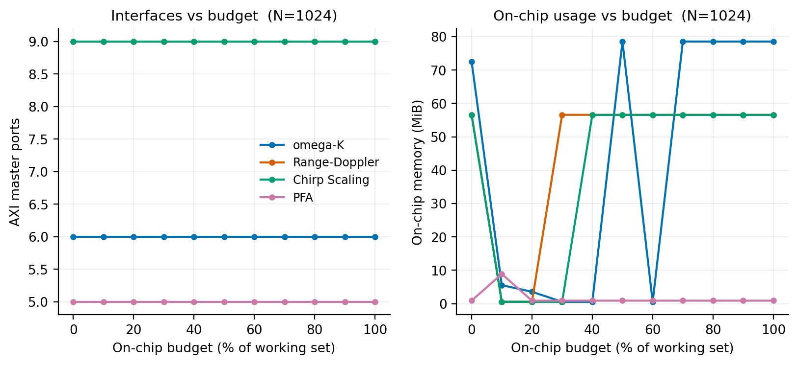
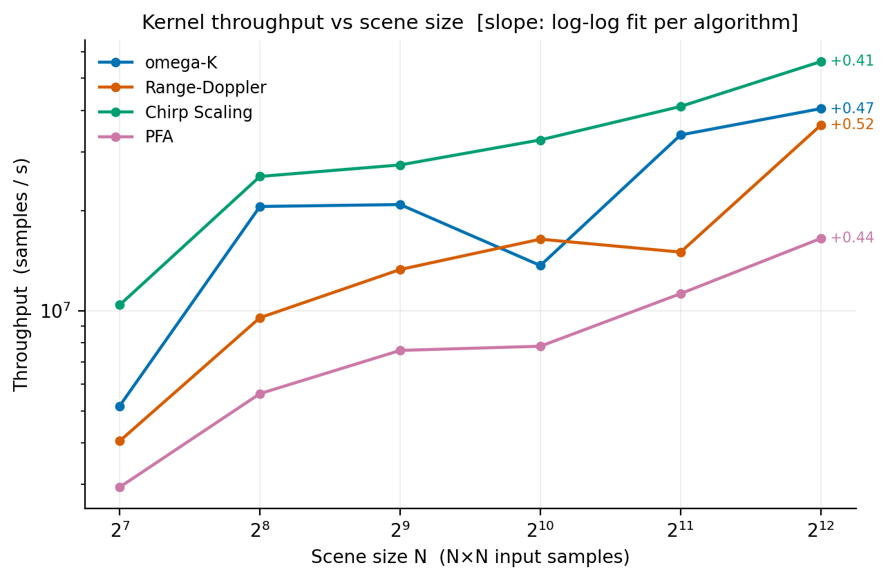

# Benchmarks

| File | Purpose |
|------|---------|
| `algorithms.py` | Registry of the benchmarked imaging chains (setup, run, reference) |
| `metrics.py` | Point-target metrics: IRW / PSLR / ISLR (also used by `test/python/test_quality.py`) |
| `run_performance.py` | Timing and throughput-N curves: compiled kernels vs the NumPy references; reports cold and warm separately |
| `run_accuracy.py` | Cross-backend accuracy: CPU and HLS csim versus the same NumPy reference; `--dtype c64` builds the chains single-precision, completing the backend x precision matrix |
| `run_quality.py` | Image-quality table |
| `run_precision.py` | What single precision costs an image; covers all four chains and both complex widths |
| `run_resources.py` | What each chain costs on an FPGA; `--budget-sweep` for port/memory vs budget |
| `run_figures.py` | Publication figures into `assets/` |

```bash
PYTHONPATH=python python3 benchmarks/run_performance.py \
    --sizes 128 256 512 1024 2048 4096 --numpy
PYTHONPATH=python python3 benchmarks/run_accuracy.py --n 512
PYTHONPATH=python python3 benchmarks/run_quality.py --n 512
PYTHONPATH=python python3 benchmarks/run_precision.py --n 512
PYTHONPATH=python python3 benchmarks/run_resources.py --sizes 512 4096
PYTHONPATH=python python3 benchmarks/run_resources.py \
    --budget-sweep --sweep-size 1024 --sweep-steps 10
PYTHONPATH=python python3 benchmarks/run_figures.py
```

## Precision

Narrowing the data path narrows the kernel *boundary*; inside the body a
phase-multiply that combines a c64 data plane with an f64 geometry plane
widens back to c128 (SAR-DSL promotes on mixed-precision ops, like NumPy).
The "c64/c128 refs" column counts textual 2-D complex-type references in
the traced IR. It describes composition, not distinct allocations.

PFA's collection axes bake into the IR as f64 constants (they feed
`interp1d` positions, which the language requires to be f64), so its only
narrowable input is the phase-history plane itself. Geometry stays double
in all chains.

Single precision is a first-class build option: every chain's
`build_kernel` takes `dtype=sar.c64` (default `sar.c128`), which threads
the precision through the annotations, the widening cast and the result
types. The mode label reports what the build narrowed: the stripmap
chains take their window/axis vectors down with the data (`c64+f32`),
PFA narrows the data plane alone (`c64 only`).

Results at N=512 on a 240-logical-CPU x86-64 host:

| Algorithm | precision | IRW | PSLR | ISLR | rel. error | c64/c128 refs |
|-----------|-----------|----:|-----:|-----:|-----------:|----------------:|
| omega-K | f64 | 2.06 | -38.44 dB | -29.01 dB | — | — |
| omega-K | f32 (c64+f32) | 2.06 | -38.44 dB | -29.01 dB | 7.7e-07 | 52 / 2 |
| Range-Doppler | f64 | 2.06 | -38.79 dB | -26.54 dB | — | — |
| Range-Doppler | f32 (c64+f32) | 2.06 | -38.79 dB | -26.54 dB | 1.9e-07 | 28 / 0 |
| Chirp Scaling | f64 | 2.06 | -38.48 dB | -28.98 dB | — | — |
| Chirp Scaling | f32 (c64+f32) | 2.06 | -38.48 dB | -28.98 dB | 1.6e-07 | 38 / 6 |
| PFA | f64 | 1.80 | -13.25 dB | -9.59 dB | — | — |
| PFA | f32 (c64 only) | 1.80 | -13.25 dB | -9.59 dB | 6.3e-08 | 73 / 0 |

IRW and PSLR are unchanged across all four chains. Range-Doppler and PFA
contain no c128 references in the narrowed IR. omega-K and CSA compute
c128 geometry-phase values, then explicitly cast the phase factor before
multiplying c64 data; the accuracy column measures the resulting contract.

## FPGA resources

What a design asks of the device, measured from the emitted C++
(`run_resources.py`, 512x512, 4 MiB of block RAM + UltraRAM caps). Ports
are AXI master pointers, each on its own bundle:

| Algorithm | ports | external footprint | on-chip |
|-----------|------:|-----:|--------:|
| omega-K | 6 | 11.0 MiB | 240.5 KiB |
| Range-Doppler | 9 | 13.0 MiB | 88.0 KiB |
| Chirp Scaling | 9 | 11.0 MiB | 104.0 KiB |
| PFA | 5 | 101.9 MiB | 336.0 KiB |

PFA resamples onto a 2x oversampled polar grid, so its planes are four
times the size of its arguments and more of them have to stream. Its
collection axes bake into the design as constants (they are fixed by the
geometry the kernel was built for), so its ports are the phase-history
planes, the two images, and its typed scratch arena.

### On-chip budget sweep



`run_resources.py --budget-sweep` walks the tier caps from a few
primitives' worth up to the chain's full working set, in `--sweep-steps`
equal steps, and reports ports, external buffer footprint and on-chip usage at each
feasible point. The caps are hard, so points below the resident-table
minimum are omitted rather than emitted over budget. The upper bound is
the full working set, measured by compiling once at device-scale caps;
past it, raising the caps cannot move anything.

At N=1024 the AXI master port count is flat across the entire budget
ladder (omega-K: 6, RDA/CSA: 9, PFA: 5). The ports are the algorithm's
I/O plus a fixed set of typed scratch arenas, so raising or lowering the
budget cannot change them. The on-chip usage is non-monotone:
the buffer-placement heuristic moves whole planes (each 8 MiB at 1024)
in a binary on/off decision, so usage can jump up or down at a budget
boundary. That behavior is a property of the emitter, not a flaw.

### Vitis HLS synthesis baselines

Measured with Vitis HLS 2022.2 on 32x32 point-target designs using the
shipped `xcvu13p-fhgb2104-2-i`, 4 ns and 80% resource constraints.
`benchmarks/run_resources.py --reports ...` parses these XML reports and
fails when a timing or resource constraint is missed.

| Design | estimated clock | BRAM18K | DSP | FF | LUT | latency | interval |
|--------|----------------:|--------:|----:|---:|----:|--------:|---------:|
| omega-K | 3.187 ns | 1300 | 2203 | 352944 | 223539 | 56651 | 12322 |
| Range-Doppler | 2.899 ns | 1204 | 1033 | 267946 | 132139 | 43407 | 5986 |
| Chirp Scaling | 3.048 ns | 1268 | 1476 | 289138 | 165799 | 80611 | 16515 |
| PFA | 2.920 ns | 2958 | 1287 | 285132 | 238530 | 139615 | 20738 |

All four complete synthesis and meet the 4 ns target, the 4300-BRAM18K
memory budget and the 9830-DSP report budget. All four generated packages
also pass Vitis csim against their NumPy golden outputs. The
[machine-readable summary](results/hls_algorithms_c128_32_vitis_2022_2.json)
records constraints and report hashes. These small designs validate lowering,
directives and timing feasibility; large-raster results below are measured
separately.

Additional synthesis coverage includes AXI4-Stream interfaces, compiled
`sar.iterate` loops, f32 data paths and RTL co-simulation of the
copy-elision path. Spilled lifetimes are colored across two fixed scratch
masters per scalar type so a single arena does not serialize independent
accesses.

Production-scale c64 AXI designs, measured with the same device, 4 ns
target, and 80% resource budgets. Latency time is cycles multiplied by the
estimated clock. The hand-written WKA row is the worst-case latency; Vitis
reports a range because that design reuses transform and corner-turn
instances across runtime modes.

| Design | Grid | Clock | Latency cycles | Latency time | csynth |
|---|---:|---:|---:|---:|---:|
| WKA, generated | 16384² | 3.187 ns | 13,185,679,397 | 42.023 s | 216.21 s |
| WKA, hand-written | 16384² | 3.500 ns | 2,033,373,247 | 7.117 s | 201.24 s |
| RDA, generated | 16384² | 5.840 ns | 42,162,307,154 | 246.228 s | 199.44 s |
| CSA, generated | 16384² | 5.698 ns | 25,257,394,240 | 143.917 s | 187.00 s |
| PFA, generated | 8192² | 6.067 ns | 41,145,090,789 | 249.627 s | 168 s |

| Design | BRAM18K | URAM | DSP | FF | LUT |
|---|---:|---:|---:|---:|---:|
| WKA, generated | 162 | 296 | 539 | 153,845 | 252,020 |
| WKA, hand-written | 384 | 296 | 1,135 | 210,325 | 373,962 |
| RDA, generated | 96 | 260 | 173 | 111,871 | 223,167 |
| CSA, generated | 64 | 288 | 269 | 111,795 | 217,079 |
| PFA, generated | 160 | 216 | 391 | 163,127 | 258,089 |

Generated WKA meets 4 ns. RDA, CSA, and PFA fit the resource budgets and
miss 4 ns; remaining bottlenecks are external-load paths and
interpolation/gather throughput. These are HLS estimates, not
place-and-route closure. Generated WKA constraints and provenance are in
[`results/hls_wka_c64_16384_vitis_2022_2.json`](results/hls_wka_c64_16384_vitis_2022_2.json).

## Throughput



Kernel throughput (N² input samples / warm kernel run time, compile time
excluded) against scene size, log-log, one line per chain. Measured as
the minimum of 5 timed runs after 3 warmup passes.

## Image quality


Point-target metrics on a 512x512 synthetic scene (Hann tapers matched
to the occupied 70% bandwidth; measured with 32x upsampled
impulse-response cuts; gated in `test/python/test_quality.py`). IRW
matches the Hann theory line (1.44 bins / 0.70 occupancy = 2.06
samples). The -31.5 dB line in the figure is the ideal Hann first
sidelobe reference, not a bound on the complete imaging chain:

| Algorithm | axis | IRW (samples) | PSLR | ISLR | peak error |
|-----------|------|--------------:|-----:|-----:|:----------:|
| omega-K | range / azimuth | 2.12 / 2.12 | -38.4 / -38.4 dB | -29.0 / -31.8 dB | (0, 0) |
| Range-Doppler | range / azimuth | 2.09 / 2.12 | -38.8 / -38.4 dB | -26.5 / -31.8 dB | (0, 0) |
| Chirp Scaling | range / azimuth | 2.12 / 2.12 | -38.5 / -38.4 dB | -29.0 / -31.8 dB | (0, 0) |

Far-sidelobe floor: at deep display ranges (-60 dB) the images show
faint sidelobe arms at ~-50 dB. This floor is the Fresnel ripple of
the synthetic LFM spectrum -- paired echoes bounded by the scene's
time-bandwidth product (TBP 179 at n=512; the floor drops with TBP,
e.g. below -62 dB at n=4096, and an ideal Hann spectrum measures
-130 dB through the same pipeline, so processing adds nothing).
Range-Doppler sits ~6 dB above the others (~-43 dB, beaded arms):
the residual range-azimuth cross-coupling of the classic
no-secondary-range-compression formulation, invariant under
interpolator taps (2/4/8/16 measured identical) -- an algorithm
property, not a processing artifact.

The stripmap examples also accept a 16384x16384 ALOS-1 product and
report `metrics.urban_contrast`. The dataset is not redistributed, so
real-data wall times and quality values are intentionally not part of
the versioned reference table.

## Backend comparison

Scene: synthetic single scatterer, N×N input samples (PFA: polar-grid
edge; image is 2N×2N). Compile time excluded from run times; machine as
in [Reference numbers](#reference-numbers).

### Accuracy (N=512, vs the f64 NumPy reference)

`run_accuracy.py` focuses one scene three ways -- the reference, the CPU
backend, and the emitted design under csim -- at both build precisions
(`--dtype`). The csim leg uses no Vitis: `write_testbench` ships header
stubs that stand in for the Vitis headers, and the package is compiled
with the in-tree clang++ and run as a plain binary.

At f64 the backends sit at double-rounding distance from the reference
(and usually at the identical value, since both compile the same IR; the
CPU runtime's FFT may order its butterflies differently, which is the
Range-Doppler row):

| Algorithm | CPU err | CPU rel | csim err | csim rel | csim |
|-----------|--------:|--------:|---------:|---------:|-----:|
| omega-K | 5.8e-11 | 9.3e-13 | 5.8e-11 | 9.3e-13 | PASS |
| Range-Doppler | 1.2e-10 | 9.7e-14 | 4.7e-10 | 3.9e-13 | PASS |
| Chirp Scaling | 1.5e-11 | 2.3e-13 | 1.5e-11 | 2.3e-13 | PASS |
| PFA | 4.3e-15 | 1.7e-14 | 4.3e-15 | 1.7e-14 | PASS |

With `--dtype c64` the same columns measure what single precision costs
on each backend (relative to peak; the CPU FFT computes f64 butterflies
internally, the HLS FFT computes in the declared width, hence the gap
on the FFT-heavy omega-K). The testbench tolerance scales with the
scene peak here, since f32 rounding is proportional to the signal:

| Algorithm | CPU rel | csim rel | csim |
|-----------|--------:|---------:|-----:|
| omega-K | 1.5e-08 | 6.1e-08 | PASS |
| Range-Doppler | 1.9e-07 | 2.0e-07 | PASS |
| Chirp Scaling | 4.3e-07 | 4.3e-07 | PASS |
| PFA | 6.3e-08 | 1.2e-07 | PASS |

### Performance

CPU wall times (cold and warm, per chain and size) are tabulated once,
in [Reference numbers](#reference-numbers) below.

For HLS there is **no FPGA wall time published**. csim is a functional,
single-threaded simulation of the emitted C++ running on the host; it
validates numerics only. The csim runs above complete in 0.21–0.74 s at
N=512, and those seconds are a property of this host, not of any device.
What a design costs in cycles is what csynth reports — tabulated in
[Vitis HLS synthesis baselines](#vitis-hls-synthesis-baselines) above —
and turning cycles into device wall time would additionally need
place-and-route timing closure and a hardware (or full co-simulation)
run, which are intentionally outside the project scope. What each
design asks of a device -- ports, bundles, external footprint, on-chip, dataflow
regions -- is derived from the emitted C++ in
[FPGA resources](#fpga-resources) above.

## Reference numbers

Machine: 240 logical CPUs (the reusable runtime pool defaults to 32
affinity-limited workers), LLVM 22, `-O3 -march=native`, Python 3.12.12,
and NumPy 1.26.4. The table is from one invocation of:

```bash
PYTHONPATH=python:examples python benchmarks/run_performance.py \
  --sizes 128 256 512 1024 2048 4096 --repeats 3 --numpy
```

Times are the best warm sample after three warmups. The 16384 × 16384
stripmap rows were measured separately with `--sizes 16384 --repeats 1`.
Raw wall-time samples and environment provenance are available through
`--json`. Compile and first-call times are reported by the runner but
omitted here because compiler cache state and prior allocations in a
shared process make them unsuitable for comparison.

| Algorithm | size | warm | NumPy reference | speedup |
|-----------|-----:|-----:|----------------:|--------:|
| omega-K | 128 | 0.003 s | 0.02 s | 7.0x |
| omega-K | 256 | 0.003 s | 0.09 s | 27.5x |
| omega-K | 512 | 0.013 s | 0.32 s | 25.6x |
| omega-K | 1024 | 0.077 s | 0.69 s | 9.0x |
| omega-K | 2048 | 0.124 s | 1.89 s | 15.2x |
| omega-K | 4096 | 0.414 s | 7.37 s | 17.8x |
| omega-K | 16384 | 3.582 s | 124.08 s | 34.6x |
| Range-Doppler | 128 | 0.004 s | 0.03 s | 6.5x |
| Range-Doppler | 256 | 0.007 s | 0.07 s | 10.2x |
| Range-Doppler | 512 | 0.020 s | 0.31 s | 15.6x |
| Range-Doppler | 1024 | 0.064 s | 0.67 s | 10.5x |
| Range-Doppler | 2048 | 0.280 s | 2.09 s | 7.5x |
| Range-Doppler | 4096 | 0.465 s | 8.98 s | 19.3x |
| Range-Doppler | 16384 | 3.849 s | 157.90 s | 41.0x |
| Chirp Scaling | 128 | 0.002 s | 0.00 s | 2.0x |
| Chirp Scaling | 256 | 0.003 s | 0.01 s | 5.1x |
| Chirp Scaling | 512 | 0.010 s | 0.19 s | 19.9x |
| Chirp Scaling | 1024 | 0.032 s | 0.36 s | 11.2x |
| Chirp Scaling | 2048 | 0.102 s | 1.00 s | 9.8x |
| Chirp Scaling | 4096 | 0.299 s | 4.39 s | 14.7x |
| Chirp Scaling | 16384 | 2.807 s | 73.58 s | 26.2x |
| PFA | 128 | 0.006 s | 0.06 s | 10.3x |
| PFA | 256 | 0.012 s | 0.17 s | 14.4x |
| PFA | 512 | 0.035 s | 0.46 s | 13.3x |
| PFA | 1024 | 0.134 s | 1.53 s | 11.4x |
| PFA | 2048 | 0.373 s | 6.37 s | 17.1x |
| PFA | 4096 | 1.018 s | 28.48 s | 28.0x |

PFA's size is the polar-grid edge and its output image is 2x
oversampled. These are host measurements only; no HLS C-simulation time
is presented as FPGA throughput.
