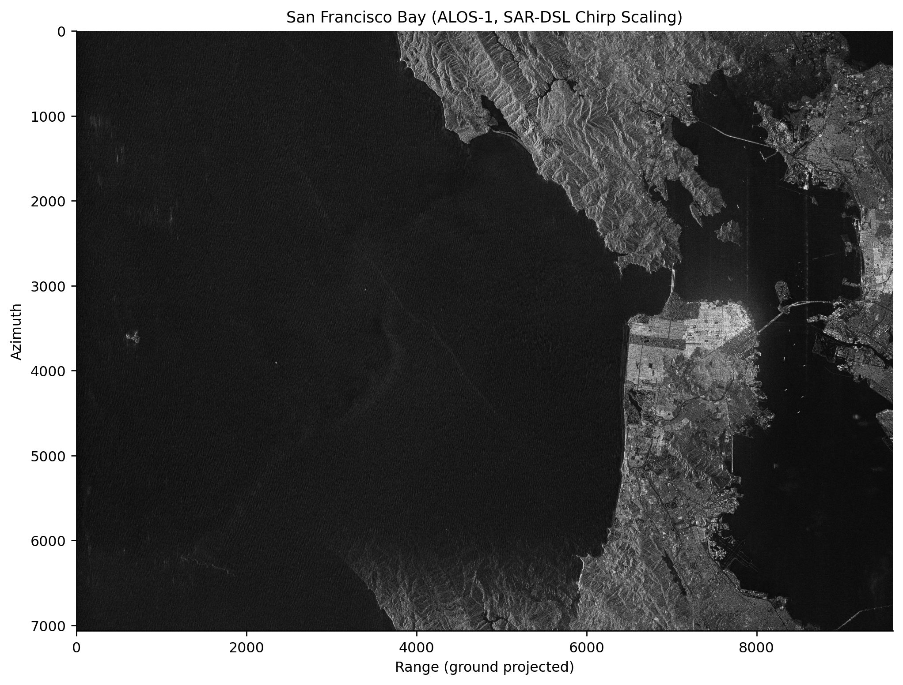

# Imaging examples

The examples implement four complete imaging chains with matching SAR-DSL kernels and NumPy references.

| Directory | Algorithm | Collection |
| --- | --- | --- |
| [`wka/`](wka/) | omega-K | stripmap; synthetic and ALOS-1 |
| [`rda/`](rda/) | Range-Doppler | stripmap; synthetic and ALOS-1 |
| [`csa/`](csa/) | Chirp Scaling | stripmap; synthetic and ALOS-1 |
| [`pfa/`](pfa/) | Polar Format with SVA | synthetic spotlight |

Each algorithm directory contains:

- `algorithm.py`: kernel construction and host inputs;
- `reference.py`: NumPy reference implementation;
- `run_point_target_cpu.py`: synthetic scene, CPU execution, metrics, and PNG output;
- `run_point_target_hls.py`: HLS source and validation package.

The stripmap examples also include `run_alos_cpu.py` and `run_alos_hls.py`. PFA uses a spotlight collection and therefore has no ALOS stripmap runner; see its [collection notes](pfa/README.md#collection-model).

Shared radar parameters, simulation, quality reporting, plotting, and ALOS loading live under `common/`. CEOS extraction tools live under `data/`.

## Synthetic point targets

Run from the repository root after building the compiler:

```bash
PYTHONPATH=python python examples/wka/run_point_target_cpu.py --n 512
PYTHONPATH=python python examples/rda/run_point_target_cpu.py --n 512
PYTHONPATH=python python examples/csa/run_point_target_cpu.py --n 512
PYTHONPATH=python python examples/pfa/run_point_target_cpu.py --n 512
```

The CPU runners save an image and print peak-location and impulse-response metrics. The HLS runners emit a validation package:

```bash
PYTHONPATH=python python examples/wka/run_point_target_hls.py --n 256
PYTHONPATH=python python examples/rda/run_point_target_hls.py --n 256
PYTHONPATH=python python examples/csa/run_point_target_hls.py --n 256
PYTHONPATH=python python examples/pfa/run_point_target_hls.py --n 64
```

Package contents and simulation commands are documented in the [backend guide](../docs/backends.md#generated-package). Image-quality and cross-backend accuracy values are maintained in the [benchmark report](../benchmarks/README.md).

## ALOS-1 stripmap data

The real-data examples use ASF DAAC granule [`ALPSRP275140740-L1.0`](https://datapool.asf.alaska.edu/L1.0/A3/ALPSRP275140740-L1.0.zip), an ALOS PALSAR FBS HH CEOS L1.0 product covering San Francisco Bay. The [ASF Data Search record](https://search.asf.alaska.edu/#/?search=ALPSRP275140740-L1.0) provides the catalog metadata and download entry; an Earthdata login may be required. Original data is © JAXA/METI.

Download and unpack the archive so the CEOS image is available at:

```text
examples/data/ALPSRP275140740-L1.0/IMG-HH-ALPSRP275140740-H1.0__A
```

For example, if the archive was saved in `~/Downloads`:

```bash
unzip ~/Downloads/ALPSRP275140740-L1.0.zip -d examples/data
```

Extract the downloaded CEOS product once, then run any stripmap chain:

```bash
PYTHONPATH=python python examples/data/extract_alos.py
PYTHONPATH=python python examples/wka/run_alos_cpu.py
PYTHONPATH=python python examples/rda/run_alos_cpu.py
PYTHONPATH=python python examples/csa/run_alos_cpu.py
```

The default full raster is 16384 × 16384 and requires substantial host memory. The HLS runners emit packages specialized to the same acquisition geometry:

```bash
PYTHONPATH=python python examples/wka/run_alos_hls.py
PYTHONPATH=python python examples/rda/run_alos_hls.py
PYTHONPATH=python python examples/csa/run_alos_hls.py
```

<div align="center">
<table>
<tr>
<td align="center"><br/>omega-K</td>
<td align="center"><br/>Chirp Scaling</td>
<td align="center"><br/>Range-Doppler</td>
</tr>
</table>
</div>

## Hand-written omega-K reference

[`wka/handwritten_hls/`](wka/handwritten_hls/) is an independent Vitis HLS implementation of the omega-K chain. It is a comparison design and hardware reference, not a SAR-DSL backend or compiler dependency.
