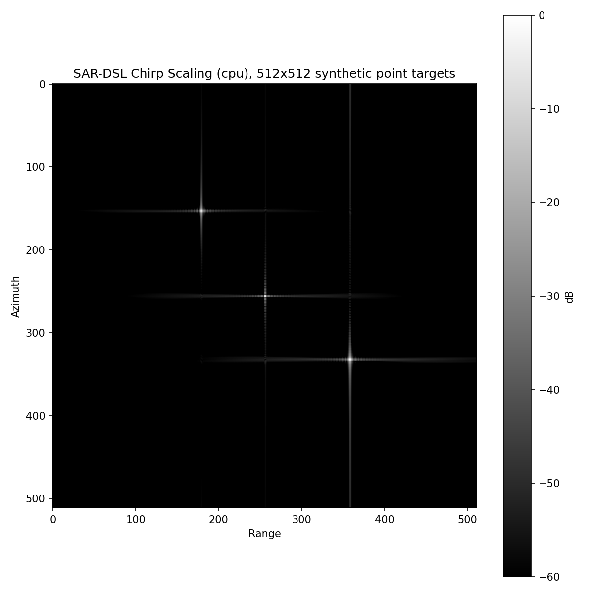

# Chirp Scaling Algorithm (CSA) with SAR-DSL

CSA is _interpolation-free_: range cell migration is equalized by a quadratic phase multiply (chirp scaling) in the range-Doppler domain, so the whole chain is element-wise phase multiplies between FFTs -- it exercises the pure phase-multiply path of the compiler on both backends.

| File | Purpose |
| --- | --- |
| `algorithm.py` | The CSA chain in the DSL (`build_kernel`, `make_inputs`) |
| `reference.py` | NumPy reference implementation (`CSAProcessor`) |
| `assets/` | Reference imagery |
| `run_point_target_cpu.py` | Full cpu-backend flow: simulate, focus, save a PNG |
| `run_point_target_hls.py` | Full hls-backend flow: HLS C++ design + validation package (`hls_project/`) |
| `run_alos_cpu.py` | Focus the real ALOS-1 San Francisco dataset |
| `run_alos_hls.py` | Emit the ALOS-geometry artifact set (see below) |

## Processing chain (zero Doppler centroid)

```
raw --> azimuth FFT
    --> chirp scaling multiply           (equalize migration trajectories)
    --> range FFT
    --> RC + SRC + bulk RCMC multiply    (2-D frequency domain)
    --> range IFFT
    --> azimuth compression multiply
    --> azimuth IFFT --> |.|
```

The Doppler-dependent factors -- migration factor `D(fa)` and modified chirp rate `Km(fa)` -- are computed inside the kernel from the `fa` axis with element-wise ops; the host only provides the `fa`/`fr`/`tau` axes.

The residual phase introduced by the scaling multiply (Cumming & Wong eq. 7.36) is not corrected: the chain outputs a magnitude image, where that term has no effect. Interferometric use would need the extra multiply after azimuth compression.

## Running

```bash
PYTHONPATH=python python examples/csa/run_point_target_cpu.py --n 512
PYTHONPATH=python python examples/csa/run_point_target_hls.py --n 256
```

The CPU runner saves a focused image and reports impulse-response metrics. The HLS runner writes `hls_project/csa/`; package contents are listed in the [backend guide](../../docs/backends.md#generated-package). Numerical results are maintained in the [benchmark report](../../benchmarks/README.md).



## Real data (ALOS-1)

```bash
PYTHONPATH=python python examples/data/extract_alos.py
PYTHONPATH=python python examples/csa/run_alos_cpu.py
PYTHONPATH=python python examples/csa/run_alos_hls.py
```

The runner reports wall time and urban-area contrast. The focused image is committed as `assets/san_francisco_csa.png`; download and prepare the matching ALOS-1 granule as described in [the examples guide](../README.md#alos-1-stripmap-data).

`run_alos_hls.py` writes `hls_project/csa_alos/`, specialized to the selected raster and HLS configuration.

Tests (`test/python/test_csa.py`) check numerical equivalence with the reference, point-target focusing, cross-algorithm agreement with omega-K, and HLS C++ emission.
