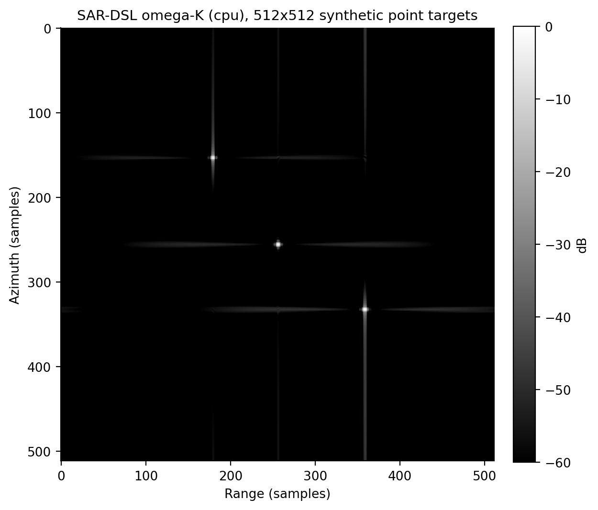

# omega-K (WKA) imaging with SAR-DSL

The complete wavenumber-domain (omega-K / WKA) SAR imaging algorithm as a
single SAR-DSL kernel, validated against a NumPy reference and
demonstrated on both synthetic point targets and a real ALOS-1 dataset.

| File | Purpose |
|------|---------|
| `algorithm.py` | The WKA chain in the DSL (`build_kernel`, `make_inputs`) |
| `reference.py` | NumPy reference implementation (`WKAProcessor`) |
| `run_point_target_cpu.py` | Full cpu-backend flow: simulate, focus, save a PNG |
| `run_point_target_hls.py` | Full hls-backend flow: HLS C++ design + csim package (`hls_project/`) |
| `run_alos_cpu.py` | Focus the real ALOS-1 San Francisco dataset (16384x16384) |
| `run_alos_hls.py` | Emit the ALOS-geometry artifact set (see below) |
| `handwritten_hls/` | Standalone FP32 Vitis HLS reference implementation |
| `assets/` | Reference imagery |

## Processing chain

```
raw --> range FFT --> corner turn --> azimuth FFT --> corner turn
    --> bulk compression (reference phase multiply)
    --> Stolt interpolation (sar.stolt_interp)
    --> range window --> azimuth window
    --> range IFFT --> corner turn --> azimuth IFFT --> corner turn --> |.|
```

Everything runs inside one compiled kernel; the host only passes the
band-matched Hann tapers as inputs. Acquisition metadata -- scalar radar
parameters (`fc`, `Vr`, `R0`, `Kr`, ...) and the frequency axes -- bakes
into the IR at trace time.

The optional [`handwritten_hls/`](handwritten_hls/) directory implements the
same processing chain directly in Vitis HLS C++. It is kept independent of
the compiler and normal example runners, and documents packed AXI, radix-4
row parallelism, engine reuse, fused Stolt processing, and ping-pong corner
turns as an optimization reference.

## Running

```bash
# from the repository root, after `make build`
python examples/wka/run_point_target_cpu.py --n 512          # focus + PNG
python examples/wka/run_point_target_hls.py --n 256     # design + csim package
```

The CPU runner reports where the brightest target landed and its
impulse response; at `--n 512` each target focuses to roughly one
resolution cell:

```
peak at (333, 358), expected (333, 358), error (+0, +0)
  range: IRW  2.12 samples, PSLR  -31.7 dB, ISLR  -28.6 dB
azimuth: IRW  2.20 samples, PSLR  -27.1 dB, ISLR  -22.9 dB
```

The HLS runner writes `hls_project/wka/`: the design `wka.cpp`, the
testbench `wka_tb.cpp`, golden data in `wka_tb_data/`, the csim and
csynth scripts (`wka_csim.tcl`, `wka_csynth.tcl`) and Vitis header
stand-ins in `stubs/`. C simulation matches the NumPy reference to
2.3e-10 over all 65536 output samples.



## Real data (ALOS-1)

```bash
# from the repository root; the dataset is shared by all three algorithms
python examples/data/extract_alos.py   # CEOS L1.0 -> alos_raw_...bin (2 GiB)
python examples/wka/run_alos_cpu.py        # tens of GiB of RAM at full size
python examples/wka/run_alos_hls.py   # emit the artifacts at that geometry
```

The runner reports wall time and urban-area contrast
(`benchmarks/metrics.py:urban_contrast`, higher is sharper). The
effective radar velocity in `ALOS_PARAMS` is autofocus-calibrated by
image-contrast maximization over the urban area. The focused image is
committed as `assets/san_francisco_wka.png`; the raw product it is made from
is not redistributed here.

`run_alos_hls.py` writes a production AXI design and a reduced
C-simulation package under `hls_project/wka_alos/`:

| Artifact | What it is |
|---|---|
| `wka_alos_axi.cpp` + `_axi_csynth.tcl` | the 16384x16384 design, `interface="axi"`: streamed planes become AXI master ports, with its synthesis script |
| `wka_alos.cpp` + `_tb.cpp` + `_csim.tcl` + `_csynth.tcl` + `_tb_data/` + `stubs/` | csim package at `--csim-n` (default 1024), same radar parameters |

Why the AXI design is not simulated, and how the csim package keeps the
acquisition's radar constants while rescaling only `t_shift`, is
covered in [examples/README.md](../README.md#real-data-alos-1). At
1024x1024 the reduced package focuses to IRW 1.65 samples in range
(PSLR -30.9 dB) and csim-matches the reference to 4.7e-10 over
1048576 samples.

Tests (`test/python/test_wka.py`) check numerical equivalence with the
reference, point-target focusing, the ALOS parameter set, and HLS C++
emission.
